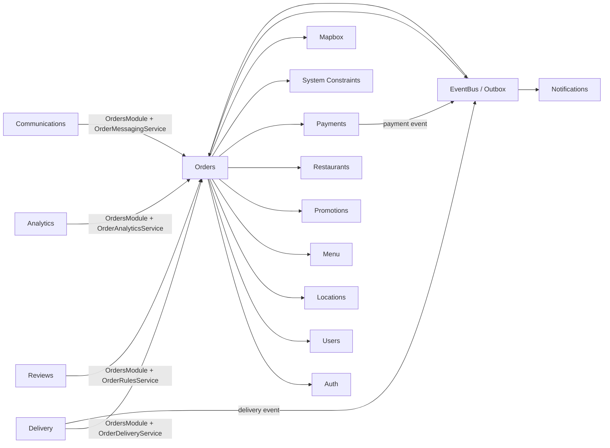

# Orders Dependency Graph

Ngày cập nhật: 2026-09-23

## Kết luận

Orders hiện có một `orders.module.ts`, một `public-api.ts`, không `forwardRef()` và không còn
module/public API phụ mang tên Reader hoặc Command. Hướng phụ thuộc giữa các feature đã thành một
chiều; không cần port trung gian cho các service nội bộ hiện tại.

## Graph hiện tại

Mũi tên thể hiện hướng phụ thuộc code hoặc event, không phải quyền sở hữu dữ liệu.

## Public consumer

| Consumer | Orders API được dùng | Mục đích |
|---|---|---|
| Delivery | `OrderDeliveryService` | dispatch data, tracking policy, shipper view và yêu cầu đổi Order status |
| Reviews | `OrderRulesService` | kiểm tra order đã hoàn tất, actor và item/shipper được review |
| Analytics | `OrderAnalyticsService` | projection và reconciliation |
| Chat/Messenger | `OrderMessagingService` | lịch sử đặt lại, tạo order sau xác nhận và quyền chat |
| App | `OrdersModule` | HTTP/GraphQL composition |

Mọi import trên đều đi qua `src/features/orders/public-api`.

## Ownership

| Dữ liệu/nghiệp vụ | Owner |
|---|---|
| Order, OrderDetail, server pricing, Order status | Orders |
| ShippingDetail, pending assignment, shipper, delivery status | Delivery |
| Checkout, gateway, provider callback | Payments |
| Promotion rules và usage | Promotions |
| Address và cleanup địa chỉ tạm | Locations |
| Review và review summary | Reviews |
| Analytics projection | Analytics |

## Bằng chứng cấu trúc

- 31 file TypeScript trong Orders.
- 1 module, 1 public API, 5 controller/resolver, 10 file service.
- Không còn `OrderService`, `OrderCoreService`, `OrderReviewRulesService` hoặc các
  `OrderDelivery*Reader/CommandService`.
- Orders không import `src/features/delivery`, `reviews`, `analytics`, `notifications` hoặc
  `communications`.
- Delivery không inject Order repository/entity.

Boundary test phải bảo vệ trạng thái này; không phục hồi module hẹp hoặc dùng `forwardRef()` để né
cycle.
