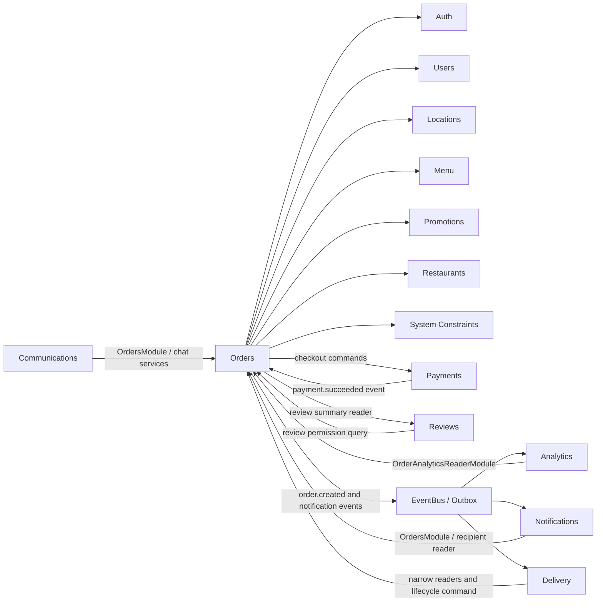

# Orders Dependency Graph

Ngày kiểm tra: 2026-09-22
Code tham chiếu: commit `6998138`

## 1. Kết luận ngắn

`orders` chưa thể chuyển ngay thành một module duy nhất và một public API duy nhất.

Nguyên nhân không phải do NestJS bắt buộc phải có nhiều module. Quan hệ hai chiều Orders–Delivery
đã được gỡ. Quan hệ hai chiều còn lại ở cấp feature là:

- Orders đọc Reviews để trang trí dữ liệu Order, trong khi Reviews hỏi Orders xem khách hàng có được
  phép đánh giá hay không.

Các module reader/command hẹp đang ngăn hai quan hệ này trở thành vòng import NestJS trực tiếp. Nếu
xóa chúng và cho tất cả consumer import `OrdersModule`, dự án sẽ tạo lại cycle và dễ dẫn đến
`forwardRef()`.

Bước chia controller theo role và gỡ chiều `Orders -> Delivery` đã hoàn thành. Chỉ gộp module sau
khi đánh giá riêng vòng Orders–Reviews và thu hẹp các consumer còn import `OrdersModule` quá rộng.

## 2. Phạm vi và số liệu hiện tại

Phạm vi kiểm tra:

- `src/features/orders/**`;
- các feature import từ Orders;
- các feature được Orders import trực tiếp;
- EventBus/Outbox liên quan vòng đời Order.

Hiện trạng:

| Thành phần                           | Số lượng |
| ------------------------------------ | -------: |
| TypeScript files trong Orders        |       48 |
| NestJS modules                       |        8 |
| Public API files                     |        7 |
| Controller/Resolver                  |        5 |
| File service có hậu tố `.service.ts` |       12 |
| `forwardRef()` trong Orders          |        0 |

Các hotspot lớn:

| File                              | Số dòng | Nhận xét                                                   |
| --------------------------------- | ------: | ---------------------------------------------------------- |
| `customer-orders.service.ts`      |     946 | Trộn tính giá, địa chỉ tạm, tạo đơn, lịch sử và thanh toán |
| `order-core.service.ts`           |     435 | Trộn state machine, pricing, policy và query/presentation  |
| `admin-orders.service.ts`         |     229 | Có Order state, payment timeout và operational command     |
| `customer-orders.controller.ts`   |     275 | Đã tách route customer nhưng vẫn còn nhiều use case        |
| `order.service.ts`                |     191 | Chủ yếu là facade chuyển tiếp sang ba role service         |
| `merchant-orders.service.ts`      |     160 | Order state và phát event sau khi đổi trạng thái           |
| `order-events.handler.ts`         |     153 | Bốn event handler khác mục đích trong một file             |
| `order-cross-feature.adapters.ts` |     148 | Trộn adapter cho Analytics, Notifications, Reviews và Chat |

## 3. Dependency graph hiện tại



Mũi tên trong sơ đồ thể hiện hướng phụ thuộc của code hoặc event consumer, không phải ownership của
dữ liệu.

## 4. Orders phụ thuộc ra ngoài

| Feature/hạ tầng    | Orders đang dùng                                                    | Loại              | Boundary hiện tại             | Đánh giá                                                      |
| ------------------ | ------------------------------------------------------------------- | ----------------- | ----------------------------- | ------------------------------------------------------------- |
| Auth               | Module, guard và permission decorator                               | Hỗ trợ API        | Public API                    | Hợp lệ                                                        |
| Users              | Current actor và identity query                                     | Read              | Public API                    | Hợp lệ                                                        |
| Locations          | Đọc, tạo và xóa địa chỉ tạm                                         | Read/write        | Public API                    | Hợp lệ nhưng `CustomerOrdersService` đang điều phối quá nhiều |
| Menu               | Snapshot món/topping để tính giá                                    | Read              | Public API                    | Hợp lệ                                                        |
| Promotions         | Kiểm tra rules và ghi usage trong transaction                       | Read/write        | Public API                    | Hợp lệ; transaction boundary nằm ở tạo Order                  |
| Restaurants        | Đọc quán đang hoạt động và tìm quán theo chủ                        | Read              | Public API                    | Hợp lệ                                                        |
| System Constraints | Phí giao hàng và giới hạn thời gian/khoảng cách                     | Read              | Public API                    | Hợp lệ                                                        |
| Mapbox             | Khoảng cách và thời gian giao                                       | Infra query       | `src/infra/mapbox/public-api` | Hợp lệ                                                        |
| Payments           | Tạo checkout, hủy checkout pending                                  | Command           | Public API                    | Một chiều và chưa tạo cycle                                   |
| Delivery           | Phát sự kiện trạng thái Order để Delivery đồng bộ assignment       | Async event       | Common EventBus               | Không còn import hoặc inject Delivery trong Orders            |
| Reviews            | Đọc review summary khi lấy Order                                    | Read              | Narrow public API             | Tạo dependency hai chiều cấp feature                          |
| EventBus/Outbox    | Order created, payment/delivery/assignment events                   | Async integration | Common events                 | Hợp lệ cho thay đổi trạng thái và retry-sensitive flow        |

### Bằng chứng quan trọng

- `orders.module.ts` không còn import `DeliveryModule`; vẫn import `PaymentModule`,
  `PromotionsModule` và `OrderReviewReaderModule`.
- `merchant-orders.controller.ts`, `admin-orders.service.ts` và `merchant-orders.service.ts` không
  còn import hoặc inject `DeliveryDispatchService`.
- Subscription đăng ký active shipper đã được chuyển từ `order.resolver.ts` sang
  `delivery/controllers/shipper.resolver.ts`. Delivery dùng kiểu GraphQL qua
  `order-delivery-shipper.public-api.ts`, không import trực tiếp Order entity.
- `order-core.service.ts` gọi `OrderReviewReaderService` để gắn review summary vào Order response.
- `customer-orders.service.ts` tạo `ORDER_CREATED_EVENT` trong Outbox và dùng
  `PromotionUsageService` trong cùng transaction.

## 5. Các feature phụ thuộc vào Orders

| Consumer                 | API/module Orders đang dùng                        | Mục đích                                                            | Read/write     | Đánh giá                                                   |
| ------------------------ | -------------------------------------------------- | ------------------------------------------------------------------- | -------------- | ---------------------------------------------------------- |
| Delivery                 | 4 reader modules và 1 lifecycle command module     | Dispatch, tracking, shipper views, completion và cập nhật lifecycle | Read + command | Ownership đúng: Order status vẫn do Orders quyết định      |
| Analytics                | `OrderAnalyticsReaderModule`                       | Project/reconcile snapshot                                          | Read           | Đúng hướng; không dùng Order repository                    |
| Reviews                  | `OrderReviewEligibilityModule`                     | Kiểm tra khách đã mua và Order completed                            | Read/policy    | Đúng ownership nhưng tạo chiều ngược với Orders -> Reviews |
| Notifications            | `OrdersModule` và `OrderNotificationReaderAdapter` | Tìm người nhận notification                                         | Read           | Quá rộng; chỉ cần một reader hẹp                           |
| Communications/Messenger | `OrdersModule` và `OrderMessagingReaderService`    | Kiểm tra quyền chat theo Order                                      | Read           | Quá rộng; chỉ cần messaging reader                         |
| Communications/Chat      | `OrdersModule` và `ChatOrderingService`            | Xem đơn gần đây và tạo đơn từ chat                                  | Read + command | Hành vi hợp lệ nhưng import cả module chính                |
| App composition          | `OrdersModule`                                     | Gắn HTTP/GraphQL API                                                | Composition    | Hợp lệ                                                     |

Không tìm thấy consumer nào inject trực tiếp Order repository từ feature khác trong các đường dẫn
trên.

## 6. Hai vòng phụ thuộc cần xử lý

### 6.1. Orders và Delivery

Hiện tại sau bước 2:

```text
Orders -> ORDER_STATUS_CHANGED_EVENT -> Delivery pending assignment
Delivery -> narrow Orders readers/lifecycle commands -> Orders
```

Orders không biết `DeliveryModule` hoặc `DeliveryDispatchService`. Delivery vẫn dùng các module hẹp
của Orders vì Delivery cần đọc snapshot và yêu cầu Orders thực hiện lifecycle command. Không được
gộp các module hẹp vào `OrdersModule` ngay vì sẽ tạo lại:

```text
OrdersModule -> DeliveryModule -> OrdersModule
```

Không được giải quyết bằng `forwardRef()`.

Hướng sửa đề xuất:

1. Di chuyển subscription đăng ký active shipper sang Delivery. **Đã hoàn thành.**
2. Orders phát `ORDER_STATUS_CHANGED_EVENT`; Delivery tự tạo hoặc xóa pending assignment.
   **Đã hoàn thành.**
3. Cleanup assignment hết hạn thuộc `DeliveryDispatchService`; Orders chỉ cung cấp lifecycle command
   hẹp để tự quyết định có hủy Order hay không. **Đã hoàn thành.**
4. Xóa `DeliveryModule` khỏi `OrdersModule`. **Đã hoàn thành.**

`ORDER_STATUS_CHANGED_EVENT` được ghi vào Outbox trong cùng transaction với thay đổi Order. API
process dispatch sau commit và retry các row `pending`/`failed`; queue worker không được đánh dấu
event là `published`. Outbox cũng từ chối hoàn tất nếu process dispatcher không có subscriber.

### 6.2. Orders và Reviews

Hiện tại:

```text
Orders -> OrderReviewReaderModule -> Reviews
Reviews -> OrderReviewEligibilityModule -> Orders
```

Module hẹp đang giữ cho hai module chính không import lẫn nhau. Có ba lựa chọn:

1. Giữ nguyên hai boundary hẹp. Đây là lựa chọn ít rủi ro nhất trong ngắn hạn.
2. Bỏ review summary khỏi response Order và để client gọi Reviews riêng. Cách này thay API contract.
3. Tạo projection/event cho review summary trong Orders. Cách này phức tạp hơn và chỉ nên làm nếu có
   nhu cầu hiệu năng hoặc cần một module duy nhất thật sự.

Khuyến nghị hiện tại: giữ boundary hẹp, không gộp phần Reviews trong đợt đầu.

## 7. Ownership sau refactor phải giữ nguyên

| Nghiệp vụ                                                   | Owner duy nhất |
| ----------------------------------------------------------- | -------------- |
| Trạng thái và state machine của Order                       | Orders         |
| Tính giá Order server-side                                  | Orders         |
| Snapshot OrderItem                                          | Orders         |
| Chuyến giao, pending assignment, shipper và delivery status | Delivery       |
| Checkout và gateway payment                                 | Payments       |
| Promotion rules và usage                                    | Promotions     |
| Review và review summary                                    | Reviews        |
| Analytics projection                                        | Analytics      |

Delivery được yêu cầu thay đổi Order thông qua command/event thuộc Orders; Delivery không tự ghi
Order repository. Ngược lại, Orders không được quản lý pending assignment hoặc active shipper sau
khi gỡ dependency.

## 8. Kế hoạch refactor Orders theo hai nhịp

### Nhịp 1 — Làm code dễ đọc, không đổi dependency — Đã hoàn thành

Mục tiêu:

- tách `order.controller.ts` theo actor;
- giữ nguyên route, DTO, guard, response và service hiện tại;
- không xóa module/public API hẹp;
- không thay đổi database hoặc event contract.

Cấu trúc controller đề xuất:

```text
controllers/
├── public-orders.controller.ts
├── customer-orders.controller.ts
├── merchant-orders.controller.ts
├── admin-orders.controller.ts
└── order.resolver.ts
```

Public controller chỉ chứa ba route thực sự đang public; không tạo shipper controller rỗng. GraphQL
subscription thuộc shipper đã được chuyển sang Delivery ở bước đầu Nhịp 2.

Exit gate:

- route/guard contract test pass;
- authorization/BOLA test pass;
- build, Orders unit và integration test pass;
- không có `forwardRef` hoặc cross-feature deep import mới.

### Nhịp 2 — Sửa hướng phụ thuộc

Thứ tự:

1. Chuyển active shipper subscription sang Delivery. **Đã hoàn thành.**
2. Chuyển pending-assignment orchestration sang Delivery. **Đã hoàn thành.**
3. Xóa `OrdersModule -> DeliveryModule`. **Đã hoàn thành.**
4. Phục hồi Order `confirmed` bị thiếu pending assignment. **Đã hoàn thành.**
5. Thu hẹp Notifications và Messenger khỏi broad `OrdersModule` nếu có thể.
6. Đánh giá riêng vòng Orders–Reviews trước khi gộp module.
7. Chỉ xóa module/public API hẹp khi `rg` xác nhận không còn consumer.

Exit gate:

- feature graph không còn `Orders -> Delivery`;
- Delivery vẫn không inject Order repository;
- Orders vẫn là nơi duy nhất cập nhật Order status;
- assignment, completion, payment, notification và analytics regression test pass;
- không dùng `forwardRef()`.

## 9. Quyết định chưa được phép giả định

Trước khi gỡ vòng Orders–Reviews cần quyết định rõ API Order có bắt buộc trả review summary trong
cùng response hay không. Đây là thay đổi contract, không nên tự quyết chỉ để giảm số module.

Tương tự, mục tiêu “một module, một public API” là mục tiêu về khả năng đọc code, không phải luật
cao hơn ownership. Nếu việc gộp tạo dependency hai chiều thì boundary hẹp phải được giữ lại cho đến
khi hướng phụ thuộc được sửa.

## 10. Bước triển khai nhỏ nhất tiếp theo

Nhịp 1 đã tách `order.controller.ts` thành public/customer/merchant/admin controller, giữ nguyên
toàn bộ route và service call.

Delivery đã có cron phục hồi Order `confirmed` bị thiếu pending assignment. Cron chỉ chạy ở API,
đọc ID qua reader hẹp của Orders và dùng thao tác tạo idempotent của Delivery.

Bước nhỏ nhất tiếp theo là thu hẹp Notifications, Messenger và Chat khỏi broad
`OrdersModule`. Không gộp Orders–Reviews trước khi quyết định review summary có bắt buộc
nằm trong Order response hay không.

Không thực hiện đồng thời việc gộp module, đổi event, đổi schema hoặc format toàn repository trong
commit này.
