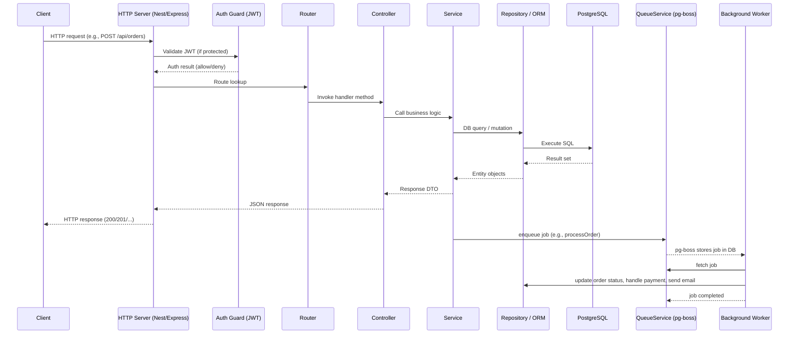

# Code Execution Flow – Fooddie Backend

> This document outlines the typical runtime path for a request through the Fooddie backend, from the HTTP entry point to background job processing via **pg‑boss**. Adjust the diagram if you add new modules or change the framework.

---

## 1️⃣ Entry Point

| File | Purpose |
|------|---------|
| `src/main.ts` (or `src/app.ts`) | Boots the Node.js process, creates the HTTP server (NestJS/Express), applies global middleware (CORS, body‑parser, helmet, request‑logging), and registers all modules/controllers. |

The server listens on the port defined in `.env` (default `3000`).

---

## 2️⃣ Request Lifecycle (Synchronous Path)



### Key Steps Explained

1. **HTTP Server** – Starts the app and registers all routes.
2. **Auth Guard** – For protected routes, validates the JWT from the `Authorization` header. If invalid, a `401` is returned immediately.
3. **Router** – Matches the request URL & method to a controller method.
4. **Controller** – Thin layer that extracts parameters, validates DTOs, and forwards the call to a service.
5. **Service** – Contains the core business logic. May call multiple repositories, external APIs, or the **QueueService**.
6. **Repository / ORM** – Interacts with PostgreSQL (via TypeORM/Prisma). Handles transactions when needed.
7. **QueueService (`src/pg-boss/queue.service.ts`)** – Wraps **pg‑boss**. When a service needs asynchronous processing (e.g., order processing, email sending), it enqueues a job with a payload.
8. **Background Worker** – Separate process (often started by a NestJS `@Processor` or a plain script) that polls pg‑boss, picks up jobs, and executes the heavy‑weight work (payment gateway calls, inventory updates, sending emails, etc.).
9. **Database** – Stores both the domain data and the pg‑boss job tables (`pgboss.job`).

---

## 3️⃣ Asynchronous Flow (pg‑boss)

1. **Enqueue** – Service calls `queueService.add('process-order', payload)`.
2. **pg‑boss** writes a row into `pgboss.job` with status `created`.
3. **Worker** (started with `npm run worker` or as a NestJS `@Processor`) continuously polls the job table.
4. When a job is fetched, pg‑boss updates its status to `active` and the worker executes the handler.
5. The handler may:
   - Update order status in the DB.
   - Call external payment APIs.
   - Publish events to a message broker.
   - Send notification emails (via the Notification endpoint).
6. Upon success, the job status becomes `completed`; on failure, it is marked `failed` and may be retried based on the retry policy.

---

## 4️⃣ Configuration & Cross‑Cutting Concerns

| Concern | Implementation |
|---------|----------------|
| **CORS** | `src/config/configure-gcs-cors.js` (or similar) sets allowed origins for the HTTP server.
| **Logging** | Global logger (e.g., `winston` or NestJS `Logger`) logs request/response and job processing.
| **Error Handling** | Centralized exception filter returns a consistent JSON error shape.
| **Validation** | DTO classes with `class-validator` ensure request bodies are correct before reaching services.
| **Environment** | `.env` provides DB connection string, JWT secret, pg‑boss config, etc.

---

## 5️⃣ Typical End‑to‑End Example: Placing an Order

1. **Client** sends `POST /api/orders` with order details.
2. **Auth Guard** validates the JWT.
3. **OrderController** receives the request and forwards to **OrderService**.
4. **OrderService** creates an `Order` entity in the DB (status `PENDING`).
5. **OrderService** calls `queueService.add('process-order', { orderId })`.
6. **HTTP response** `202 Accepted` is returned to the client with the new order ID.
7. **Background Worker** picks up the `process-order` job:
   - Calls payment provider.
   - Updates order status to `PAID` or `FAILED`.
   - Sends a confirmation email via the Notification endpoint.
8. Client can later `GET /api/orders/:id` to see the updated status.

---

## 6️⃣ Visual Summary (High‑Level Architecture)

```mermaid
flowchart TD
    A[Client] --> B[HTTP Server]
    B -->|Auth| C[Auth Guard]
    B --> D[Router]
    D --> E[Controller]
    E --> F[Service]
    F --> G[Repository]
    G --> H[PostgreSQL]
    F --> I[QueueService (pg‑boss)]
    I --> J[pg‑boss Job Table]
    J --> K[Background Worker]
    K --> G
    K --> L[External APIs (Payment, Email)]
```

---

*Generated on 2026‑01‑20 by Antigravity – your AI coding assistant.*
