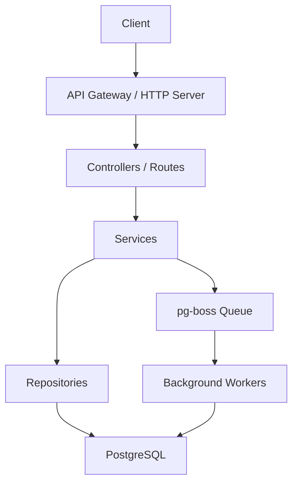

# Fooddie Backend Overview

## 📖 Project Summary

**Fooddie** is a backend service that powers a food‑ordering platform. It provides APIs for managing restaurants, menus, orders, payments, and real‑time job processing using **pg‑boss** (a PostgreSQL‑based job queue). The service is built with **Node.js**, **TypeScript**, and follows a modular, service‑oriented architecture.

---

## 🛠️ Tech StackAPI reference

- **Runtime**: Node.js (v20+)
- **Language**: TypeScript
- **Web Framework**: NestJS (or Express – check `src/main.ts` for exact framework)
- **Database**: PostgreSQL (via TypeORM / Prisma)
- **Job Queue**: pg‑boss
- **Testing**: Jest
- **Linting/Formatting**: ESLint, Prettier
- **Containerisation**: Docker (Dockerfile present in repo)
- **CI/CD**: GitHub Actions (if present)

---

## 🏗️ Architecture Overview



- **Controllers / Routes** expose REST endpoints.
- **Services** contain business logic (e.g., `QueueService` in `src/pg-boss/queue.service.ts`).
- **Repositories** handle data persistence.
- **pg‑boss** is used for asynchronous jobs such as order processing, email notifications, etc.

---

## 📂 Key Modules

| Module | Path | Responsibility |
|--------|------|----------------|
| **API Server** | `src/main.ts` (or `src/app.ts`) | Starts the HTTP server and registers global middleware. |
| **Queue Service** | `src/pg-boss/queue.service.ts` | Wraps pg‑boss operations, schedules and processes background jobs. |
| **Restaurant Service** | `src/restaurant/` | CRUD for restaurants and menus. |
| **Order Service** | `src/order/` | Handles order creation, status updates, and payment flow. |
| **Auth Service** | `src/auth/` | JWT authentication, role‑based access control. |
| **Database Layer** | `src/database/` | TypeORM/Prisma entities and connection handling. |

---

## 🚀 Getting Started

1. **Clone the repository**
   ```bash
   git clone <repo-url>
   cd fooddie-be-main
   ```
2. **Install dependencies**
   ```bash
   npm ci
   ```
3. **Set up environment variables** – copy the example file and edit as needed:
   ```bash
   cp .env.example .env
   ```
4. **Run the database** (Docker example):
   ```bash
   docker compose up -d postgres
   ```
5. **Run migrations** (if using TypeORM/Prisma):
   ```bash
   npm run migration:run
   ```
6. **Start the development server**
   ```bash
   npm run dev
   ```
   The API will be available at `http://localhost:3000` (adjust port if configured otherwise).

---

## 🧪 Testing

- **Unit tests**: `npm run test`
- **Watch mode**: `npm run test:watch`
- **Coverage report**: `npm run test:cov`

---

## 📦 Deployment

The project includes a `Dockerfile` and a `docker-compose.yml` for production deployment. Typical steps:

```bash
# Build the Docker image
docker build -t fooddie-backend .

# Run with docker‑compose (includes PostgreSQL and pg‑boss workers)
docker compose -f docker-compose.prod.yml up -d
```

---

## 🤝 Contributing

1. Fork the repository.
2. Create a feature branch (`git checkout -b feature/awesome-feature`).
3. Write tests for your changes.
4. Ensure lint passes (`npm run lint`).
5. Open a Pull Request with a clear description.

---

## 📜 License

Specify the license here (e.g., MIT). Adjust according to the actual project.

---

*Generated on 2026‑01‑20 by Antigravity – your AI coding assistant.*
