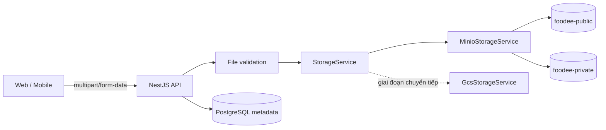
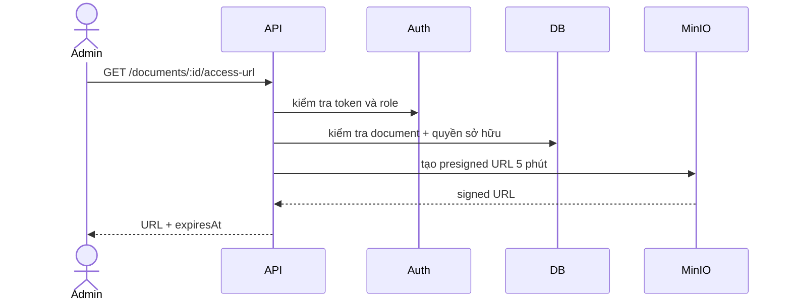

# Phase 4 — Xây dựng nền tảng lưu trữ MinIO

## 1. Kết quả cần đạt

Sau phase này, backend có một lớp lưu trữ thống nhất và có thể dùng MinIO trong môi trường local mà không làm hỏng dữ liệu ảnh đang tồn tại.

Kết quả cụ thể:

- MinIO chạy cùng Docker Compose và dữ liệu không mất khi container khởi động lại.
- File công khai và file riêng tư được tách thành hai bucket.
- Các module nghiệp vụ không còn phụ thuộc trực tiếp vào `GcsService`.
- API upload hiện tại vẫn giữ nguyên để frontend không phải sửa đồng loạt.
- Có kiểm tra loại file, dung lượng, tên object và quyền truy cập.
- GCS vẫn được giữ làm phương án tương thích trong thời gian chuyển đổi.

## 2. Phạm vi và giả định

### Trong phạm vi

- Ảnh món ăn.
- Avatar và ảnh nền nhà hàng.
- Banner khuyến mãi.
- Avatar người dùng nếu dự án có endpoint upload tương ứng.
- Giấy phép nhà hàng, CCCD và bằng lái của shipper.

### Ngoài phạm vi phase này

- Tải toàn bộ ảnh cũ về MinIO. Việc đó thuộc Phase 5.
- Dùng MinIO local làm giải pháp production mặc định.
- Chuyển file riêng tư thành URL công khai.
- Xóa GCS hoặc credential GCS ngay lập tức.

> Lưu ý quan trọng: MinIO là dịch vụ lưu object, không phải nơi lưu metadata nghiệp vụ. Database vẫn lưu thông tin món ăn, nhà hàng và quyền sở hữu; MinIO chỉ lưu nội dung file.

## 3. Kiến trúc đích



Nguyên tắc phụ thuộc:

```text
Food / Restaurant / Promotion / User modules
                    ↓
          STORAGE_SERVICE token
                    ↓
       MinioStorageService hoặc GcsStorageService
```

Module nghiệp vụ chỉ biết hợp đồng `StorageService`, không biết SDK của MinIO hoặc GCS.

## 4. Thiết kế bucket và quyền truy cập

| Bucket | Mục đích | Anonymous read | Ví dụ |
|---|---|---:|---|
| `foodee-public` | Nội dung được phép hiển thị công khai | Có, chỉ `GET` | ảnh món ăn, banner, avatar |
| `foodee-private` | Hồ sơ nhạy cảm | Không | CCCD, bằng lái, giấy phép |

Quy tắc bắt buộc:

- Không cho anonymous upload hoặc delete ở bất kỳ bucket nào.
- Không đặt giấy tờ cá nhân vào bucket public.
- File private chỉ được đọc bằng presigned URL thời hạn ngắn, sau khi backend kiểm tra quyền.
- Không trả `MINIO_SECRET_KEY` hoặc thông tin credential về frontend.
- Production phải dùng HTTPS và credential khác local.

## 5. Cấu hình môi trường

### 5.1 Biến môi trường đề xuất

```env
MINIO_ENDPOINT=minio
MINIO_PORT=9000
MINIO_ACCESS_KEY=foodee_local_admin
MINIO_SECRET_KEY=replace_with_a_long_local_secret
MINIO_USE_SSL=false
MINIO_PUBLIC_BUCKET=foodee-public
MINIO_PRIVATE_BUCKET=foodee-private
MINIO_PUBLIC_URL=http://localhost:9000
STORAGE_DRIVER=minio
```

Không commit secret production. File `.env.example` chỉ chứa tên biến và giá trị mẫu không nhạy cảm.

### 5.2 Kiểm tra cấu hình khi khởi động

Thêm schema validation để ứng dụng dừng sớm nếu:

- `STORAGE_DRIVER=minio` nhưng thiếu endpoint hoặc credential.
- Port không phải số hợp lệ.
- Tên bucket rỗng.
- `MINIO_USE_SSL` không chuyển được thành boolean.
- Production đang dùng secret local mặc định.

## 6. Triển khai theo từng bước

### Bước 4.1 — Thêm MinIO vào Docker Compose

Thêm service `minio`:

- Image được ghim version, không dùng `latest`.
- API port nội bộ `9000`, console `9001`.
- Có volume riêng, ví dụ `minio_data`.
- Có healthcheck gọi endpoint health của MinIO.
- Command khởi động server và console.

Thêm service khởi tạo `minio-init` dùng MinIO Client (`mc`):

1. Chờ MinIO healthy.
2. Tạo alias bằng credential local.
3. Tạo hai bucket nếu chưa tồn tại.
4. Chỉ áp dụng read policy cho bucket public.
5. Kết thúc thành công và có thể chạy lặp lại.

Checklist:

- [ ] `docker compose config` hợp lệ.
- [ ] MinIO API truy cập được tại `http://localhost:9000`.
- [ ] MinIO Console truy cập được tại `http://localhost:9001`.
- [ ] Restart container không làm mất object.
- [ ] `foodee-public` đọc được object không cần đăng nhập.
- [ ] `foodee-private` trả Access Denied nếu đọc trực tiếp.

### Bước 4.2 — Cài SDK và tạo lớp hạ tầng

Cài package MinIO Node.js tương thích với phiên bản Node của dự án. Không import SDK vào module nghiệp vụ.

Cấu trúc đề xuất:

```text
src/infra/storage/
├── storage.module.ts
├── storage.constants.ts
├── storage.types.ts
├── storage.service.ts
├── minio-storage.service.ts
├── gcs-storage.service.ts
└── storage-key.factory.ts
```

Hợp đồng tối thiểu:

```ts
export interface StorageService {
  uploadPublicFile(input: UploadFileInput): Promise<StoredObject>;
  uploadPrivateFile(input: UploadFileInput): Promise<StoredObject>;
  getPrivatePresignedUrl(key: string, expiresInSeconds?: number): Promise<string>;
  objectExists(bucket: StorageBucket, key: string): Promise<boolean>;
  deleteFile(bucket: StorageBucket, key: string): Promise<void>;
}
```

`StoredObject` nên có:

- `key`: khóa ổn định trong object storage.
- `bucket`: public hoặc private.
- `url`: URL công khai nếu có.
- `contentType`.
- `size`.
- `etag` hoặc checksum nếu SDK cung cấp.

Tạo injection token, ví dụ `STORAGE_SERVICE`, và chọn implementation bằng `STORAGE_DRIVER`.

### Bước 4.3 — Chuẩn hóa object key

Không dùng nguyên tên file từ người dùng vì có thể trùng tên hoặc chứa ký tự nguy hiểm.

Mẫu key:

```text
foods/{foodId}/{uuid}.{ext}
restaurants/{restaurantId}/avatar/{uuid}.{ext}
restaurants/{restaurantId}/background/{uuid}.{ext}
promotions/{promotionId}/{uuid}.{ext}
users/{userId}/avatar/{uuid}.{ext}
private/restaurants/{restaurantId}/certificate/{uuid}.{ext}
private/shippers/{shipperId}/identity/{uuid}.{ext}
```

Quy tắc:

- ID tài nguyên phải đến từ backend, không tin đường dẫn do client gửi.
- Extension được suy ra từ MIME đã xác thực, không chỉ từ tên file.
- Không cho `..`, dấu gạch chéo tùy ý hoặc ký tự điều khiển.
- Tên key phải duy nhất và có thể truy vết về entity.
- Không nhúng email, số điện thoại hoặc CCCD vào key.

### Bước 4.4 — Validation file tập trung

Tạo cấu hình validation dùng chung:

| Nhóm file | MIME đề xuất | Giới hạn ban đầu |
|---|---|---:|
| Ảnh public | `image/jpeg`, `image/png`, `image/webp` | 5 MB |
| Giấy tờ private | JPEG, PNG, PDF nếu nghiệp vụ cần | 10 MB |

Các lớp kiểm tra:

1. Kiểm tra request thực sự có file.
2. Kiểm tra MIME được Multer nhận.
3. Kiểm tra magic bytes/signature để giảm giả mạo MIME.
4. Kiểm tra kích thước.
5. Chuẩn hóa extension.
6. Từ chối SVG nếu chưa có bước sanitize, vì SVG có thể chứa script.

Phản hồi lỗi phải thống nhất, ví dụ:

```json
{
  "statusCode": 400,
  "code": "INVALID_UPLOAD_FILE",
  "message": "Chỉ chấp nhận JPEG, PNG hoặc WebP tối đa 5 MB"
}
```

### Bước 4.5 — Cài đặt `MinioStorageService`

Yêu cầu implementation:

- Khởi tạo một MinIO client dùng lại, không tạo client mới cho mỗi request.
- Upload stream/buffer cùng đúng `Content-Type`.
- Gắn metadata tối thiểu, tránh lưu dữ liệu cá nhân không cần thiết.
- Bọc lỗi SDK thành lỗi hạ tầng có mã rõ ràng.
- Log `operation`, `bucket`, `key`, thời gian và kết quả; không log file bytes hoặc secret.
- Presigned URL private mặc định ngắn, ví dụ 5 phút.
- `deleteFile` xử lý rõ object không tồn tại theo chính sách idempotent.

Không tự động tạo bucket trong mỗi request. Bucket được tạo bởi bước khởi tạo hạ tầng.

### Bước 4.6 — Bọc GCS bằng cùng interface

Đổi `GcsService` hiện tại thành hoặc bọc bởi `GcsStorageService` để cùng tuân theo `StorageService`.

Mục đích:

- Có thể chuyển driver bằng cấu hình.
- Giảm rủi ro khi MinIO mới được đưa vào.
- Dễ rollback mà không sửa lại từng module.

Không xóa code GCS trong phase này.

### Bước 4.7 — Chuyển module nghiệp vụ sang abstraction

Thực hiện từng module, không sửa tất cả trong một commit lớn:

1. Food.
2. Restaurant.
3. Promotion.
4. User/avatar nếu có.
5. Hồ sơ private của restaurant/shipper.

Với mỗi module:

- Thay concrete injection `GcsService` bằng `STORAGE_SERVICE`.
- Giữ nguyên URL, method và DTO của endpoint upload nếu có thể.
- Backend tự quyết định bucket theo loại tài liệu.
- Upload object trước, sau đó cập nhật DB.
- Nếu cập nhật DB thất bại, cố gắng xóa object vừa upload và log cleanup failure.
- Khi thay ảnh, chỉ xóa ảnh cũ sau khi ảnh mới đã upload và DB cập nhật thành công.

### Bước 4.8 — Quyết định cách lưu tham chiếu trong database

Khuyến nghị dài hạn: lưu `storageKey`, `storageBucket` và tùy chọn `storageProvider`; URL hiển thị được tạo ở response mapper.

Giai đoạn chuyển tiếp có thể vẫn gặp hai dạng:

- URL tuyệt đối cũ: `https://...`.
- Object key mới: `foods/123/...webp`.

Reader phải xử lý cả hai dạng trong Phase 5. Không thay toàn bộ dữ liệu bằng chuỗi URL MinIO cứng nếu production có thể dùng domain/CDN khác.

### Bước 4.9 — Endpoint đọc file private

Luồng đề xuất:



Không nhận trực tiếp `bucket` và `key` tùy ý từ client. Client gửi ID tài liệu; backend tra key đáng tin cậy từ DB.

## 7. Kiểm thử bắt buộc

### Unit test

- Key factory không tạo key có `..` hoặc dữ liệu cá nhân.
- File validator chấp nhận/từ chối đúng MIME và kích thước.
- Provider factory chọn đúng MinIO/GCS.
- Public URL được tạo đúng.
- Lỗi SDK được map đúng mã lỗi ứng dụng.

### Integration test

- Upload ảnh vào public bucket rồi đọc lại được.
- Upload private và không đọc anonymous được.
- Presigned URL private hoạt động trước khi hết hạn.
- Xóa object hoạt động và có tính idempotent theo thiết kế.
- Container restart vẫn còn object.

### API smoke test

- Upload ảnh món ăn bằng user có quyền.
- API đọc món ăn trả URL hiển thị được.
- User không quyền không upload được.
- Upload file quá lớn/MIME sai trả 400.
- Truy cập giấy tờ private không role trả 403.

## 8. Chiến lược rollout

1. Merge Docker và storage abstraction nhưng để `STORAGE_DRIVER=gcs` nếu môi trường hiện tại còn phụ thuộc GCS.
2. Bật MinIO ở local.
3. Chuyển một endpoint ít rủi ro, ví dụ banner hoặc ảnh test.
4. Theo dõi log upload/read/delete.
5. Chuyển lần lượt các module public.
6. Sau khi quyền được kiểm thử, chuyển tài liệu private.
7. Sang Phase 5 mới xử lý dữ liệu cũ.

## 9. Rollback

- Đổi `STORAGE_DRIVER` về `gcs` đối với upload mới nếu abstraction tương thích.
- Không xóa object MinIO đã ghi; đánh dấu để đối soát sau.
- Không chạy migration DB ngược nếu có thể giữ cột mới nullable.
- Nếu public URL lỗi, trả lại URL cũ còn lưu trong DB/manifest.
- Ghi lại thời điểm, endpoint và object key bị ảnh hưởng.

## 10. Deliverables

- [ ] MinIO và init service trong Docker Compose.
- [ ] Hai bucket và policy đúng.
- [ ] `.env.example` và config validation.
- [ ] `StorageModule`, interface và injection token.
- [ ] MinIO implementation.
- [ ] GCS adapter tương thích.
- [ ] Validation và key factory dùng chung.
- [ ] Các module nghiệp vụ không inject SDK trực tiếp.
- [ ] Unit/integration/API smoke tests.
- [ ] Runbook upload, quyền truy cập và rollback.

## 11. Điều kiện hoàn thành phase

Chỉ chuyển sang Phase 5 khi:

- [ ] Build, lint và test liên quan đều pass.
- [ ] MinIO khởi động tự động cùng Compose.
- [ ] Public/private policy đã được kiểm chứng bằng request thật.
- [ ] Ít nhất một luồng upload public hoạt động end-to-end.
- [ ] Ít nhất một luồng private dùng presigned URL và authorization hoạt động.
- [ ] API contract hiện tại không bị phá vỡ ngoài thay đổi đã ghi tài liệu.
- [ ] Có rollback về storage driver cũ.

