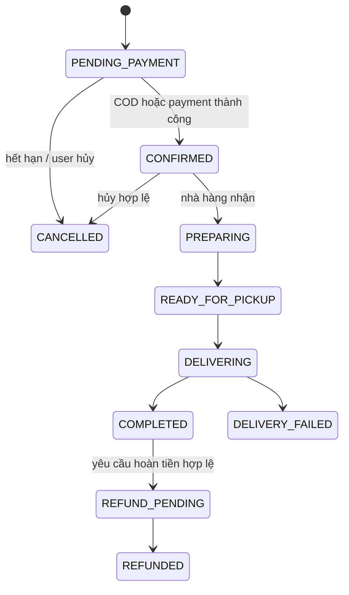
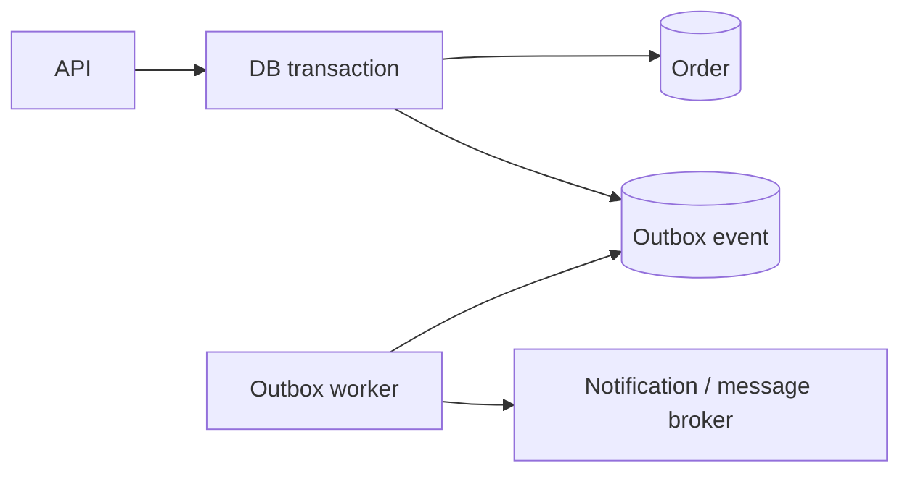

# Phase 6 — Làm chắc luồng đơn hàng và thanh toán

## 1. Mục tiêu

Đảm bảo người dùng không bị tạo trùng đơn, tính sai tiền hoặc cập nhật sai trạng thái khi request lặp, webhook đến trễ hay một bước giữa chừng thất bại.

Ưu tiên phase này cao hơn mở rộng chatbot, vì chatbot cuối cùng cũng gọi vào cùng nghiệp vụ đặt hàng.

## 2. Nguyên tắc nghiệp vụ

- Backend là nguồn sự thật về giá, phí, giảm giá và tổng tiền.
- Client chỉ gửi ý định mua, không quyết định số tiền phải thanh toán.
- Mỗi thay đổi trạng thái đơn phải tuân theo state machine.
- Tạo đơn và cập nhật tồn kho/khuyến mãi phải nằm trong transaction phù hợp.
- Request hoặc webhook có thể đến nhiều lần; xử lý phải idempotent.
- Không coi redirect từ trình duyệt là bằng chứng thanh toán thành công.
- Chỉ webhook đã xác minh chữ ký mới được cập nhật trạng thái payment.

## 3. Khảo sát trước khi sửa

Lập sơ đồ hiện trạng:

1. Endpoint tạo đơn và DTO.
2. Service tính giá.
3. Bảng order, order item, payment, promotion usage.
4. Tích hợp cổng thanh toán và webhook/callback.
5. Luồng hủy, hoàn tiền và shipper nhận đơn.
6. Các side effect: notification, event publish, chatbot response.

Tạo bảng nguồn dữ liệu:

| Giá trị | Nguồn đáng tin cậy |
|---|---|
| Giá món hiện tại | Database/backend |
| Số lượng | Client gửi, backend validate |
| Phí giao hàng | Backend calculator/config |
| Khuyến mãi | Backend promotion service |
| Tổng thanh toán | Backend tổng hợp |
| Trạng thái payment | Webhook hợp lệ/provider query |

## 4. State machine đề xuất

Tên trạng thái thực tế phải bám entity hiện có; không đổi enum chỉ để giống tài liệu.



Tạo một hàm/policy duy nhất kiểm tra transition. Không rải điều kiện `if status === ...` ở nhiều service.

## 5. Thực hiện theo bước

### Bước 6.1 — Chuẩn hóa contract tạo đơn

DTO chỉ nhận dữ liệu cần thiết:

- Restaurant ID.
- Danh sách `foodId`, `quantity`, option/topping ID nếu có.
- Address ID hoặc dữ liệu địa chỉ theo contract rõ ràng.
- Promotion code/ID.
- Payment method.
- Ghi chú đã giới hạn độ dài.

Không tin các trường do client gửi:

- `unitPrice`.
- `subtotal`.
- `discountAmount`.
- `shippingFee`.
- `totalAmount`.
- Role/user ID không lấy từ token.

Đặt giới hạn số item và quantity để tránh abuse.

### Bước 6.2 — Tách bộ máy tính giá

Tạo `OrderPricingService` hoặc domain service thuần:

1. Load món ăn và restaurant trong một số query hợp lý.
2. Xác minh món còn bán và cùng nhà hàng.
3. Lấy giá hiện tại từ DB.
4. Tính subtotal bằng kiểu số an toàn cho tiền.
5. Tính phí giao hàng theo policy.
6. Validate promotion ở thời điểm transaction.
7. Tính discount có giới hạn, không để total âm.
8. Trả breakdown đầy đủ.

Không dùng floating point tùy ý cho tiền. Dùng integer theo đơn vị nhỏ nhất hoặc decimal type nhất quán.

### Bước 6.3 — Transaction tạo đơn

Trong một transaction:

- Kiểm tra lại dữ liệu có thể thay đổi.
- Tạo order.
- Tạo order items với snapshot tên/giá tại thời điểm mua.
- Ghi promotion usage/reservation.
- Cập nhật tồn kho nếu hệ thống quản lý tồn kho.
- Tạo payment attempt ở trạng thái khởi tạo.
- Ghi outbox event nếu dùng outbox.

Không gọi API thanh toán bên ngoài trong transaction DB dài. Có thể commit intent trước, sau đó gọi provider và cập nhật payment attempt theo thiết kế saga/outbox.

### Bước 6.4 — Idempotency cho tạo đơn

Client gửi header `Idempotency-Key` duy nhất cho một lần bấm đặt hàng.

Backend lưu:

- User ID.
- Endpoint/action.
- Idempotency key.
- Hash request chuẩn hóa.
- Trạng thái xử lý.
- Response/order ID.
- Thời gian hết hạn.

Quy tắc:

- Cùng key + cùng request: trả lại kết quả cũ.
- Cùng key + request khác: trả 409.
- Key đang xử lý: chờ ngắn hoặc trả trạng thái rõ ràng, không tạo đơn thứ hai.
- Unique constraint ở DB là lớp bảo vệ cuối.

### Bước 6.5 — Payment attempt và webhook

Mỗi lần thanh toán có `paymentAttemptId` riêng, liên kết order.

Webhook phải:

1. Đọc raw body nếu provider yêu cầu ký trên raw payload.
2. Xác minh chữ ký, timestamp và secret.
3. Chống replay theo event ID/provider transaction ID.
4. Lưu payload tối thiểu đã sanitize để audit.
5. Lock payment/order phù hợp.
6. Kiểm tra transition hợp lệ.
7. Update idempotently.
8. Trả 2xx cho event đã xử lý trước đó.

Không log toàn bộ thông tin thẻ, token thanh toán hoặc secret.

### Bước 6.6 — Hủy và hoàn tiền

Xác định rõ:

- Ai được hủy ở trạng thái nào.
- Promotion/tồn kho được hoàn lại lúc nào.
- Payment đã thu thì dùng refund flow, không chỉ đổi order thành cancelled.
- Partial refund có được hỗ trợ hay không.
- Retry refund và đối soát provider.

Mọi thay đổi tiền phải có audit trail và reference đến actor/provider event.

### Bước 6.7 — Side effect tin cậy

Notification, email và event publish không nên làm transaction tạo đơn thất bại sau khi DB đã commit.

Khuyến nghị outbox:



Worker retry có giới hạn và dead-letter/failed status để điều tra.

### Bước 6.8 — Authorization theo actor

- Customer chỉ xem/hủy đơn của chính mình theo policy.
- Restaurant chỉ thao tác đơn thuộc restaurant của họ.
- Shipper chỉ thao tác đơn được gán/được phép nhận.
- Admin có quyền theo role/permission, có audit.
- Không dựa vào ID gửi trong body để xác định actor.

## 6. API và lỗi thống nhất

Mã lỗi nghiệp vụ đề xuất:

```text
FOOD_NOT_AVAILABLE
ITEMS_FROM_MULTIPLE_RESTAURANTS
PROMOTION_NOT_APPLICABLE
ORDER_STATE_CONFLICT
IDEMPOTENCY_KEY_REUSED
PAYMENT_SIGNATURE_INVALID
PAYMENT_ALREADY_PROCESSED
ORDER_ACCESS_DENIED
```

Lỗi conflict trạng thái/idempotency nên dùng 409; validation dùng 400; thiếu auth 401; không đủ quyền 403.

## 7. Kiểm thử

### Unit/domain tests

- Pricing với quantity, discount, rounding và total tối thiểu.
- Tất cả transition hợp lệ/không hợp lệ.
- Promotion hết hạn, hết quota, sai restaurant.
- Idempotency hash và conflict.
- Webhook signature adapter.

### Integration tests

- Transaction rollback nếu tạo item thất bại.
- Hai request đồng thời cùng key chỉ tạo một order.
- Hai người cùng dùng quota promotion cuối cùng không vượt quota.
- Duplicate webhook không update hai lần.
- Webhook đến trước redirect hoặc đến trễ vẫn đúng.
- Side effect lỗi không làm mất order/outbox.

### End-to-end scenarios

1. COD thành công.
2. Online payment thành công.
3. Payment thất bại và retry.
4. User bấm nút đặt hàng nhiều lần.
5. Restaurant từ chối/hủy theo policy.
6. Shipper nhận và hoàn tất đơn.
7. Unauthorized actor bị chặn.

## 8. Quan sát và đối soát

Theo dõi metric:

- Orders created/succeeded/failed.
- Duplicate request prevented.
- Payment attempts theo trạng thái.
- Invalid webhook signatures.
- Orders mắc kẹt quá thời gian ở mỗi trạng thái.
- Sai lệch tổng tiền nội bộ và provider.
- Outbox retry/dead-letter.

Tạo job đối soát payment định kỳ nếu provider hỗ trợ query transaction.

## 9. Rollout và rollback

Rollout:

1. Thêm schema tương thích ngược.
2. Deploy code đọc được cả dữ liệu cũ/mới.
3. Bật pricing mới dưới feature flag.
4. Bật idempotency cho nhóm test/staging.
5. Bật webhook handler mới và quan sát.
6. Mới loại bỏ logic cũ sau thời gian ổn định.

Rollback:

- Tắt feature flag logic mới.
- Giữ cột/bảng mới để không mất audit.
- Không tự động đảo trạng thái payment đã xác nhận.
- Với sai lệch tiền/trạng thái, đóng luồng tạo mới nếu cần và đối soát thủ công.

## 10. Deliverables và điều kiện hoàn thành

- [ ] Tài liệu state machine và actor permissions.
- [ ] Pricing service được backend kiểm soát.
- [ ] Transaction boundary rõ ràng.
- [ ] Idempotency có unique constraint.
- [ ] Payment attempt và webhook verification.
- [ ] Audit/outbox cho side effect quan trọng.
- [ ] Unit, integration và E2E tests pass.
- [ ] Dashboard/queries đối soát có sẵn.
- [ ] Runbook xử lý order/payment mắc kẹt.
- [ ] Đã thử duplicate/concurrency trên staging mà không tạo trùng đơn.

