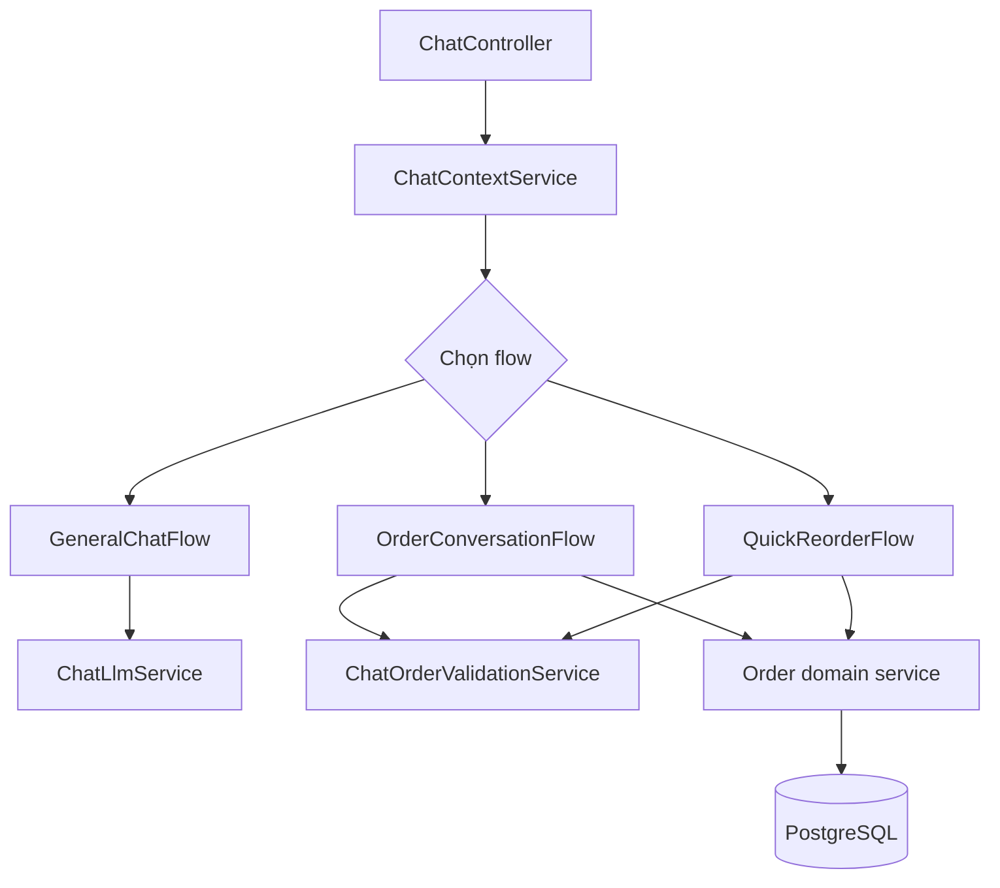
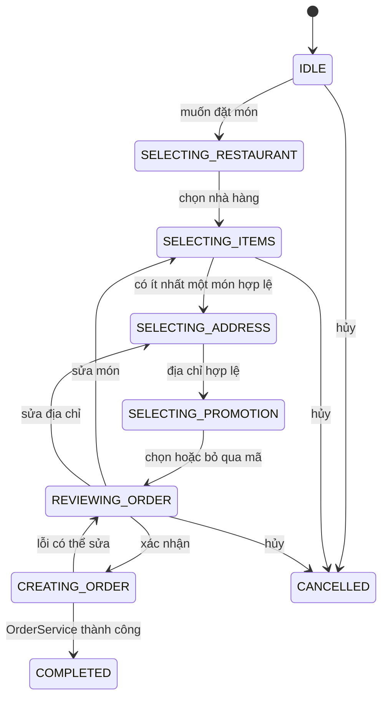

# Phase 7 — Nâng cấp chatbot đặt món an toàn và dễ bảo trì

## 1. Mục tiêu

Biến chatbot thành lớp hội thoại hỗ trợ người dùng, không phải nơi tự quyết định nghiệp vụ. Chatbot thu thập ý định và dữ liệu; các service nghiệp vụ xác thực giá, địa chỉ, khuyến mãi và tạo đơn.

## 2. Kiến trúc vai trò



Ranh giới bắt buộc:

- LLM không được ghi DB trực tiếp.
- Parser không được tự gọi tạo đơn.
- Giá và availability luôn được xác minh lại từ backend.
- Chỉ bước xác nhận cuối mới gọi use case tạo đơn.

## 3. Chuẩn hóa trạng thái hội thoại

Nếu hiện tại context chứa nhiều boolean như `isSelectingFood`, `isConfirming`, hãy chuyển dần sang một `step` rõ ràng:

```ts
type OrderConversationStep =
  | 'IDLE'
  | 'SELECTING_RESTAURANT'
  | 'SELECTING_ITEMS'
  | 'SELECTING_ADDRESS'
  | 'SELECTING_PROMOTION'
  | 'REVIEWING_ORDER'
  | 'CREATING_ORDER'
  | 'COMPLETED'
  | 'CANCELLED';
```

Trong thời gian chuyển tiếp, adapter có thể đọc boolean cũ và ánh xạ sang `step`. Không xóa field cũ trước khi session đang tồn tại hết hạn hoặc được migrate.

State context tối thiểu:

- `conversationId`, `userId`.
- `flowType`, `step`, `version`.
- Restaurant đã chọn.
- Items gồm ID và quantity, không tin giá snapshot từ LLM.
- Address ID.
- Promotion code/ID.
- Payment method.
- `lastUpdatedAt`, `expiresAt`.
- Idempotency key cho lệnh tạo đơn cuối.

## 4. Luồng đặt món chuẩn



Tại `REVIEWING_ORDER`, chatbot phải trả bản tóm tắt rõ:

- Nhà hàng.
- Món, số lượng, đơn giá backend vừa tính.
- Tạm tính.
- Phí giao hàng.
- Khuyến mãi.
- Tổng tiền.
- Địa chỉ.
- Phương thức thanh toán.
- Nút/hành động: xác nhận, sửa món, sửa địa chỉ, hủy.

## 5. Structured output từ LLM

Không parse câu trả lời tự do bằng regex nếu có thể yêu cầu output có schema.

Ví dụ intent output:

```json
{
  "intent": "ADD_ITEM",
  "entities": {
    "foodName": "cơm gà",
    "quantity": 2
  },
  "confidence": 0.91,
  "needsClarification": false
}
```

Yêu cầu:

- Schema validation sau khi model trả về.
- Unknown field bị bỏ hoặc từ chối theo policy.
- Confidence thấp thì hỏi lại, không tự suy đoán dữ liệu quan trọng.
- Không cho model tạo `userId`, giá, quyền hay order status.
- Có fallback khi model timeout, JSON lỗi hoặc quota hết.
- Prompt có version để test/regression.

## 6. Thực hiện theo bước

### Bước 7.1 — Ghi contract của từng file/service

Với mỗi controller, flow và service trong module chat, ghi:

- Input/output.
- Dependency được phép gọi.
- Có/không được tạo side effect.
- Các lỗi có thể trả.
- Test chịu trách nhiệm.

Đây là hàng rào để module không tiếp tục phình to và trùng trách nhiệm.

### Bước 7.2 — Tách router và flow

- Controller chỉ xác thực request và gọi orchestration.
- Router chọn general/order/reorder dựa trên context + intent.
- Mỗi flow xử lý state transition của chính nó.
- Validation dùng chung nằm ở service riêng.
- Tạo đơn gọi use case/service của order module, không copy logic đặt hàng vào chat.

### Bước 7.3 — Validation theo từng transition

Trước khi đổi step:

- Restaurant tồn tại và đang hoạt động.
- Food tồn tại, đang bán và thuộc restaurant.
- Quantity trong giới hạn.
- Address thuộc user và có đủ dữ liệu cần thiết.
- Promotion được OrderPricingService xác minh.
- Payment method được hỗ trợ.

Nếu validation fail, giữ state hợp lý và hướng dẫn người dùng sửa đúng trường.

### Bước 7.4 — Quick reorder

Quick reorder không được sao chép mù đơn cũ:

1. Kiểm tra đơn cũ thuộc user.
2. Load lại món hiện tại.
3. Loại/đánh dấu món ngừng bán.
4. Tính lại giá.
5. Không tự dùng promotion cũ nếu không còn hợp lệ.
6. Yêu cầu xác nhận địa chỉ hiện tại.
7. Hiển thị chênh lệch giá trước khi xác nhận.
8. Dùng idempotency key khi tạo đơn.

### Bước 7.5 — Quản lý context/session

Nếu đang lưu in-memory, ghi rõ hạn chế: mất khi restart và không chia sẻ giữa nhiều API instance.

Lộ trình:

1. Định nghĩa `ChatSessionRepository` interface.
2. Có in-memory implementation cho test/local.
3. Có Redis implementation cho staging/production.
4. TTL cho session không hoạt động.
5. Optimistic version hoặc lock ngắn để chống hai message đồng thời.
6. Không lưu secret/payment token trong context.

### Bước 7.6 — Xử lý gửi lặp và concurrency

- Mỗi message có `messageId` từ client hoặc backend.
- Duplicate message trả lại response trước đó nếu còn cache.
- Khi step là `CREATING_ORDER`, message xác nhận lặp không tạo order mới.
- Chat và endpoint order dùng cùng idempotency mechanism Phase 6.
- Dùng context version để phát hiện update chồng nhau.

### Bước 7.7 — An toàn prompt và dữ liệu

- Không đưa password, token, CCCD, payment secret vào prompt.
- Chỉ gửi dữ liệu tối thiểu cần cho intent.
- Nội dung người dùng luôn được coi là dữ liệu, không phải system instruction.
- Tool/action whitelist cố định ở backend.
- Giới hạn độ dài message và lịch sử.
- Có chính sách retention/log redaction.
- Không hiển thị stack trace hoặc raw model error cho người dùng.

### Bước 7.8 — Trải nghiệm lỗi và fallback

Các tình huống phải có câu trả lời cụ thể:

- Không hiểu món nào.
- Có nhiều món trùng tên.
- Nhà hàng đóng cửa.
- Món vừa hết.
- Địa chỉ không hợp lệ.
- Promotion hết hiệu lực.
- LLM timeout.
- Order service tạm lỗi.

Khi LLM lỗi, các action có cấu trúc đang hiện vẫn phải dùng được nếu có thể.

## 7. API response đề xuất

Response có cấu trúc để frontend render ổn định:

```json
{
  "conversationId": "...",
  "message": "Bạn kiểm tra lại đơn hàng nhé",
  "step": "REVIEWING_ORDER",
  "data": {
    "orderPreview": {}
  },
  "actions": [
    { "type": "CONFIRM_ORDER", "label": "Xác nhận" },
    { "type": "EDIT_ITEMS", "label": "Sửa món" },
    { "type": "CANCEL", "label": "Hủy" }
  ],
  "metadata": {
    "promptVersion": "order-v2"
  }
}
```

Frontend không nên phải đọc câu văn để đoán hành động tiếp theo.

## 8. Chiến lược kiểm thử

### State transition tests

- Mỗi step có action hợp lệ và action bị từ chối.
- Hủy ở mọi step hỗ trợ.
- Sửa món/địa chỉ từ review quay đúng step.
- Tạo đơn fail có thể retry an toàn.

### LLM contract tests

- JSON hợp lệ.
- JSON malformed.
- Unknown intent.
- Confidence thấp.
- Prompt injection trong user message.
- Model timeout/rate limit.

Mock LLM trong CI để test ổn định; test thật với provider chạy riêng và có budget.

### Conversation scenarios

- Đặt món đầy đủ bằng tiếng Việt tự nhiên.
- Người dùng đổi ý giữa chừng.
- Chọn món trùng tên.
- Quick reorder khi giá thay đổi.
- Quick reorder khi món đã ngừng bán.
- Hai tin nhắn xác nhận đồng thời.
- Session hết hạn.
- API restart giữa hội thoại khi dùng Redis.

### Regression dataset

Tạo tập câu tiếng Việt đã ẩn dữ liệu cá nhân, gắn expected intent/entities. Mỗi lần đổi prompt/model chạy lại và so sánh:

- Intent accuracy.
- Entity extraction accuracy.
- Clarification rate.
- Invalid structured output rate.
- Tỷ lệ tạo order thành công sau xác nhận.

## 9. Quan sát và chi phí

Metric:

- Số conversation theo flow.
- Tỷ lệ fallback/clarification.
- LLM latency, timeout và token usage.
- Invalid parser output.
- Drop-off theo step.
- Duplicate order prevented.
- Order conversion rate.

Log dùng `conversationId`, `messageId`, `flow`, `step`, `promptVersion`; không log nội dung nhạy cảm nguyên bản.

## 10. Rollout và rollback

Rollout:

1. Thêm response field mới tương thích ngược.
2. Chạy shadow classification nếu có thể, không tạo side effect.
3. Bật state machine mới cho tài khoản nội bộ.
4. Bật một phần user bằng feature flag.
5. Theo dõi drop-off, lỗi parser và duplicate.
6. Mở rộng dần.

Rollback:

- Tắt flow mới bằng feature flag.
- Giữ adapter đọc session cũ/mới.
- Không rollback order đã tạo; order module là nguồn sự thật.
- Nếu model lỗi diện rộng, chuyển chatbot sang chức năng hướng dẫn/tìm kiếm không tạo đơn.

## 11. Điều kiện hoàn thành

- [ ] Vai trò từng file/service được tài liệu hóa.
- [ ] Có state machine chính thức và transition tests.
- [ ] LLM output được schema validate.
- [ ] Giá/khuyến mãi/availability lấy từ domain service.
- [ ] Quick reorder kiểm tra lại toàn bộ dữ liệu động.
- [ ] Duplicate confirm không tạo trùng đơn.
- [ ] Context có TTL và chiến lược nhiều instance.
- [ ] Regression dataset đạt ngưỡng đã thống nhất.
- [ ] Dashboard/metric cơ bản hoạt động.
- [ ] Có feature flag và fallback khi LLM không sẵn sàng.

