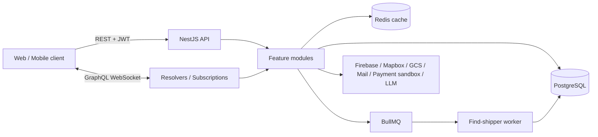

# FOODEE Backend — Tài liệu giới thiệu dự án khi phỏng vấn

> Tài liệu này được đối chiếu với code hiện tại, không lấy các README cũ làm nguồn chính. Mục tiêu
> là giúp trình bày đúng những gì dự án đã làm, hiểu quyết định kỹ thuật và thẳng thắn về phần chưa
> hoàn thiện.

## 1. Giới thiệu trong 30 giây

FOODEE là backend cho nền tảng đặt và giao đồ ăn, kết nối bốn nhóm người dùng: khách hàng, nhà
hàng, shipper và quản trị viên. Hệ thống hỗ trợ tìm món/nhà hàng, tính giá và khuyến mãi, tạo đơn,
theo dõi trạng thái, ghép shipper, nhắn tin, thông báo thời gian thực và báo cáo vận hành.

Backend được xây dựng dưới dạng **modular monolith** bằng NestJS và TypeScript. PostgreSQL lưu dữ
liệu nghiệp vụ; Redis dùng cho cache, trạng thái ghép shipper và BullMQ; REST phục vụ phần lớn API,
còn GraphQL Subscription qua WebSocket phục vụ các sự kiện thời gian thực.

## 2. Bài toán và mục đích

Một đơn giao đồ ăn không chỉ là thao tác CRUD. Hệ thống phải phối hợp nhiều bên và quản lý một quy
trình có trạng thái:

1. Khách chọn món, topping, địa chỉ, hình thức giao và mã giảm giá.
2. Server tự tính lại giá, phí giao, phần thu nhập shipper và tổng tiền.
3. Nhà hàng tiếp nhận hoặc xác nhận đơn.
4. Hệ thống tìm shipper phù hợp và gửi đề nghị giao hàng.
5. Shipper nhận đơn, cập nhật quá trình giao; khách nhận thay đổi trạng thái theo thời gian thực.
6. Sau khi hoàn tất, hệ thống cập nhật số liệu và cho phép đánh giá món ăn hoặc shipper.

Mục đích của dự án là xây dựng backend quản lý xuyên suốt quy trình trên, đồng thời tách nghiệp vụ
theo feature để một codebase vẫn có thể phục vụ nhiều loại client.

## 3. Người dùng và chức năng chính

### Khách hàng

- Đăng ký, đăng nhập bằng email/mật khẩu hoặc Google qua Firebase ID token.
- Quản lý hồ sơ và địa chỉ nhận hàng.
- Tìm kiếm nhà hàng, món ăn, danh mục, món bán chạy, món mới và món giảm giá.
- Chọn topping, tính trước tổng tiền, áp dụng khuyến mãi và tạo đơn.
- Theo dõi trạng thái đơn, xem lịch sử, đặt lại nhanh và đánh giá món/shipper.
- Nhắn tin, nhận thông báo và sử dụng FoodeeBot hỗ trợ hội thoại đặt món.

### Chủ nhà hàng

- Gửi yêu cầu đăng ký nhà hàng và tải hồ sơ/hình ảnh.
- Quản lý thông tin nhà hàng, menu, topping và trạng thái món.
- Nhận đơn mới theo thời gian thực, xác nhận đơn và theo dõi doanh thu/số đơn.

### Shipper

- Đăng ký tài khoản và hồ sơ chứng nhận để quản trị viên duyệt.
- Cập nhật vị trí, nhận đề nghị giao hàng, chấp nhận hoặc từ chối đơn.
- Cập nhật các bước nhận/giao/hoàn tất đơn.
- Xem lịch sử, thu nhập, hiệu suất, thống kê và thành tích.

### Quản trị viên

- Quản lý user, role, permission và phân quyền.
- Duyệt/từ chối nhà hàng và shipper.
- Quản lý danh mục, khuyến mãi và theo dõi dashboard vận hành.

## 4. Kiến trúc hiện tại

FOODEE là **modular monolith theo feature**, không phải microservice và cũng không triển khai đầy
đủ Clean Architecture.



Các feature chính gồm `auth`, `users`, `role`, `restaurant`, `food`, `category`, `order`, `shipper`,
`promotion`, `review`, `messenger`, `notification`, `dashboard` và `chat`. Hạ tầng dùng chung được
đặt trong `src/infra`, gồm database, cache, queue, storage, maps, mail và payment gateway.

Quy tắc module hiện tại là Controller–Service–Module:

- Controller/Resolver nhận request, validation và gọi service.
- Service chứa API nghiệp vụ của feature.
- DTO định nghĩa input và validation.
- Module sở hữu provider và repository; module khác phải import module sở hữu provider.
- Service lớn được phép tách thành các service nhỏ theo trách nhiệm, nhưng không bắt buộc tạo các
  tầng `domain/application/infrastructure` cho mọi feature.

Chi tiết quy tắc nằm tại [CODING_STANDARDS.md](./CODING_STANDARDS.md).

## 5. Công nghệ sử dụng và lý do

| Công nghệ                     | Vai trò trong dự án                                          | Lý do phù hợp                                                                             |
| ----------------------------- | ------------------------------------------------------------ | ----------------------------------------------------------------------------------------- |
| NestJS 11 + TypeScript        | Framework backend                                            | Module, dependency injection, guard, pipe và decorator giúp tổ chức backend nhiều feature |
| Express                       | HTTP adapter                                                 | Tương thích tốt với hệ sinh thái NestJS và middleware hiện có                             |
| REST + Swagger                | API nghiệp vụ chính và tài liệu API ở môi trường development | Dễ tích hợp với web/mobile và kiểm thử endpoint                                           |
| GraphQL Apollo + `graphql-ws` | Subscription cho đơn hàng, shipper, tin nhắn và thông báo    | Client nhận sự kiện ngay thay vì polling liên tục                                         |
| PostgreSQL + TypeORM          | Dữ liệu quan hệ và transaction                               | Phù hợp quan hệ user–role, restaurant–food, order–detail, promotion và shipping           |
| Redis + ioredis               | Cache và trạng thái tạm                                      | Truy cập nhanh, TTL, lock `SET NX` và lưu assignment ngắn hạn                             |
| BullMQ                        | Hàng đợi tìm shipper                                         | Retry/backoff, worker riêng và tách xử lý nền khỏi request xác nhận đơn                   |
| JWT + bcrypt                  | Xác thực local                                               | JWT cho API stateless; bcrypt băm mật khẩu                                                |
| Firebase Admin                | Xác minh Google/Firebase ID token                            | Không tin dữ liệu Google do client tự gửi                                                 |
| Mapbox                        | Khoảng cách và thời gian tuyến giao hàng                     | Tính theo tuyến đường; có Haversine fallback khi Mapbox lỗi                               |
| Google Cloud Storage          | Lưu ảnh và hồ sơ                                             | Tách file khỏi database, hỗ trợ public/private file và signed URL                         |
| Nodemailer                    | OTP/quên mật khẩu                                            | Gửi email cho các luồng xác thực và khôi phục tài khoản                                   |
| Gemini 2.0 Flash / local LLM  | FoodeeBot                                                    | Hỗ trợ chat tổng quát và hội thoại đặt/đặt lại món                                        |
| Docker                        | Đóng gói API, PostgreSQL và Redis                            | Môi trường chạy có thể tái tạo, kèm volume và health check                                |
| Jest + ESLint + Prettier      | Kiểm thử và chất lượng code                                  | Tạo quality gate cho build, test, lint và format                                          |

## 6. Các luồng kỹ thuật nên trình bày

### 6.1 Xác thực và phân quyền

- Email/mật khẩu được kiểm tra bằng bcrypt; server ký JWT chứa định danh và role.
- Đăng ký Google nhận Firebase ID token, xác minh token bằng Firebase Admin rồi mới tạo/tìm user.
- `AuthGuard` xác minh JWT. `RolesGuard` kết hợp metadata từ `@Permissions(...)` với permission lưu
  trong database.
- WebSocket có guard riêng để lấy token từ connection parameters.
- Role và permission là dữ liệu quan hệ, không hard-code toàn bộ quyền trong controller.

Điểm cần nói rõ: authentication chỉ trả lời “ai đang gọi”; endpoint còn phải kiểm tra permission và
ownership của tài nguyên. Code hiện tại chưa áp dụng hai bước này đồng đều ở mọi endpoint.

### 6.2 Tạo và tính tiền đơn hàng

Server nhận danh sách món/topping, địa chỉ, promotion và hình thức giao, sau đó:

1. Đọc lại món và giá từ database, không dùng tổng tiền client gửi lên.
2. Kiểm tra món thuộc cùng nhà hàng và tính subtotal/topping.
3. Tính khoảng cách/phí giao, phần thu nhập shipper và phần nền tảng.
4. Validate promotion theo thời gian, loại khuyến mãi, giá trị đơn và giới hạn sử dụng.
5. Tạo `Order`, `OrderDetail` và các quan hệ trong transaction.
6. Đơn COD chuyển sang `pending`; đơn online bắt đầu ở `processing_payment`.

Đây là nơi transaction quan trọng nhất vì lỗi ở giữa không được để lại “đơn có header nhưng thiếu
chi tiết”. Một điểm cần cải thiện là việc tăng lượt dùng promotion phải an toàn trước retry và tranh
chấp đồng thời.

### 6.3 Ghép shipper bất đồng bộ

Khi nhà hàng xác nhận đơn:

1. Tạo pending assignment cho đơn và enqueue job `find-shipper`.
2. BullMQ worker đọc job; cấu hình hiện tại có retry và backoff.
3. Hệ thống lọc shipper đang hoạt động, chưa bị loại và nằm trong bán kính cho phép.
4. Khoảng cách gần nhà hàng được tính bằng Haversine để chọn ứng viên gần nhất.
5. Assignment, danh sách đã thông báo, lịch chạy và lock được lưu Redis với TTL.
6. Đề nghị được publish đến đúng shipper qua GraphQL Subscription.
7. Nếu bị từ chối/hết hạn, hệ thống loại shipper đó và lên lịch thử ứng viên tiếp theo.

`SET ... NX` và lock TTL giúp giảm khả năng nhiều worker cùng xử lý một assignment. Tuy vậy, muốn
đảm bảo tuyệt đối ở quy mô nhiều instance vẫn cần kiểm thử concurrency và ràng buộc database phù
hợp.

### 6.4 Thời gian thực

GraphQL Subscription được dùng cho:

- Nhà hàng nhận `orderCreated` khi có đơn pending.
- Khách nhận `orderStatusUpdated`.
- Shipper nhận đề nghị `orderConfirmedForShippers` theo đúng shipper ID.
- Người dùng nhận tin nhắn, trạng thái đã đọc và notification.

Hiện event bus sử dụng `graphql-subscriptions` `PubSub` trong bộ nhớ. Cách này đơn giản cho một API
instance nhưng sự kiện không được chia sẻ khi scale ngang. Hướng production là dùng Redis Pub/Sub
hoặc một message broker làm subscription backend.

### 6.5 Redis cache

Các truy vấn đọc nhiều như danh sách món, nhà hàng, danh mục và khuyến mãi dùng cache-aside qua hàm
`remember`: đọc cache trước, cache miss thì gọi loader và lưu kết quả với TTL. TTL được thêm jitter
để tránh nhiều key hết hạn cùng lúc. Các thao tác ghi phải xóa các cache key liên quan.

### 6.6 FoodeeBot

Chatbot không chỉ chuyển toàn bộ câu hỏi thẳng cho LLM. `ChatService` định tuyến theo trạng thái hội
thoại:

- Hủy quy trình.
- Đặt lại nhanh từ lịch sử đơn gần đây.
- Hội thoại tạo đơn từng bước.
- Chat tổng quát dựa trên context món ăn/nhà hàng.

Metadata giữ trạng thái như món, nhà hàng, địa chỉ và phương thức thanh toán đã được xác nhận. Các
bước nghiệp vụ vẫn được validation bằng service trước khi tạo đơn. LLM có thể gọi Gemini 2.0 Flash
hoặc endpoint tương thích OpenAI của local LLM; timeout được cấu hình để không treo request quá lâu.

### 6.7 Thanh toán

Dự án có adapter/gateway cho MoMo và VNPAY, checkout record, tạo URL thanh toán, return URL, webhook
và kiểm tra trạng thái. Đây là phần **tích hợp thử nghiệm/sandbox**, chưa nên mô tả là
production-ready.

Để đạt production-ready cần tối thiểu:

- Xác minh chữ ký ở mọi callback trước khi thay đổi dữ liệu.
- Chỉ IPN/webhook đã xác thực mới là nguồn quyết định trạng thái; return URL chỉ dùng hiển thị.
- Idempotency key hoặc unique event ID để retry không tăng promotion/food count hai lần.
- Transaction và state machine duy nhất cho `Checkout`/`Order`.
- Kiểm tra ownership khi xem hoặc thao tác checkout.
- Lưu audit log đã loại bỏ secret và dữ liệu nhạy cảm.

## 7. Mô hình dữ liệu trọng tâm

```text
Role <-> Permission
  |
 User ---- Address
  |          |
  |       Restaurant ---- Food ---- Topping
  |             |           |
  +---------- Order ----- OrderDetail
                 |
          ShippingDetail ---- Shipper(User)
                 |
             Checkout

User ---- Conversation ---- Message
User ---- Notification
Order/Food/Shipper ---- Review
Order ---- Promotion
```

Các quan hệ này giải thích vì sao PostgreSQL phù hợp: nghiệp vụ cần join, constraint, transaction và
tính nhất quán giữa nhiều bảng hơn là chỉ lưu document độc lập.

## 8. Những quyết định và đánh đổi

### Vì sao chọn modular monolith?

- Quy mô nhóm và triển khai hiện tại chưa cần chi phí vận hành microservice.
- Transaction đơn hàng trong một database đơn giản và nhất quán hơn distributed transaction.
- Vẫn có boundary theo feature, nên có thể tách service sau này nếu tải hoặc ownership thực sự yêu
  cầu.

### Vì sao dùng cả REST và GraphQL?

- REST phù hợp CRUD, command và tích hợp phổ thông.
- GraphQL hiện chủ yếu đem lại giá trị ở Subscription thời gian thực.
- Đánh đổi là hai API style làm tăng bề mặt bảo trì, guard và contract phải nhất quán ở cả HTTP lẫn
  WebSocket.

### Vì sao không xử lý tìm shipper ngay trong request?

- Tìm/đợi phản hồi shipper có thể kéo dài và thất bại tạm thời.
- Queue cho phép trả request xác nhận đơn sớm, retry có kiểm soát và quan sát job riêng.
- Đánh đổi là phải xử lý idempotency, trạng thái tạm, job trùng và dữ liệu hết hạn.

### Vì sao Redis có nhiều vai trò?

- Redis phù hợp cả cache, TTL, sorted set và lock ngắn hạn; giảm thêm một hạ tầng mới cho dự án.
- Phải đặt namespace key rõ ràng, chọn eviction policy cẩn thận và không coi Redis là nguồn dữ liệu
  nghiệp vụ lâu dài.

## 9. Chất lượng code hiện tại — trả lời trung thực

Điểm tích cực:

- Đã phân chia theo NestJS feature module và có bộ quy tắc chung trong `docs/CODING_STANDARDS.md`.
- Global `ValidationPipe` bật whitelist, transform và từ chối field thừa.
- Có transaction ở luồng tạo/xóa đơn, cache TTL, queue retry/backoff và Docker non-root user.
- Build hiện chạy được; bộ test hiện có chạy qua.

Nợ kỹ thuật cần thừa nhận:

- `order.service.ts`, `food.service.ts`, `restaurant.service.ts` và `shipper.service.ts` còn quá
  lớn, chứa nhiều nhóm trách nhiệm.
- Coverage thấp: repository hiện chỉ có năm file spec, tập trung vào app, users và role; chưa đủ cho
  order/payment/concurrency.
- `lint:modules` còn nhiều warning hiện hữu; việc format chưa đồng nghĩa code đã sạch hoàn toàn.
- Payment còn lỗi thiết kế bảo mật, idempotency và state transition như phần trên.
- In-memory PubSub không hỗ trợ tốt nhiều API instance; một số subscription/endpoint chưa áp dụng
  authorization đồng đều.
- Docker production stage hiện đặt `NODE_ENV=development`; cấu hình port cũng cần thống nhất trước
  khi gọi là image production.
- Một số tài liệu cũ vẫn nhắc `pg-boss` hoặc mô tả sai mục đích dự án; code hiện dùng BullMQ.

Khi phỏng vấn, cách nói tốt là: “Em hiểu phần nào đã hoạt động, phần nào mới là prototype và có kế
hoạch kỹ thuật cụ thể để làm nó an toàn hơn”, thay vì tuyên bố toàn hệ thống đã sẵn sàng production.

## 10. Hướng cải thiện ưu tiên

1. Khóa luồng payment: chữ ký, IPN authoritative, idempotency, transaction và ownership.
2. Viết characterization/integration test cho tạo đơn, promotion, state transition và ghép shipper
   khi retry/concurrency.
3. Tách service lớn theo query/command/pricing/assignment/statistics nhưng giữ service chính làm
   facade để không phá caller.
4. Chuẩn hóa enum trạng thái và chỉ cho chuyển trạng thái tại một service duy nhất.
5. Thay in-memory PubSub bằng Redis-backed PubSub nếu chạy nhiều instance.
6. Giảm dần lint warning; cấm warning mới trong code thay đổi.
7. Sửa Docker production config, bổ sung health endpoint và pipeline CI chạy build/lint/test.
8. Thêm migration có kiểm soát, monitoring, structured log và metrics cho queue/payment.

## 11. Câu hỏi phỏng vấn và câu trả lời gợi ý

### “Phần khó nhất của dự án là gì?”

Phần khó nhất là luồng đơn hàng vì nó kết hợp giá món/topping, promotion, phí giao, payment, nhiều
trạng thái và bốn nhóm người dùng. Em phải xác định transaction boundary cho dữ liệu đồng bộ, còn
việc tìm shipper được chuyển sang BullMQ vì đó là tác vụ kéo dài và cần retry. Em cũng nhận ra
callback payment và queue job bắt buộc phải idempotent, nếu không retry có thể tạo side effect hai
lần.

### “Nếu hai shipper cùng nhận một đơn thì sao?”

Hiện hệ thống dùng Redis lock/hold với `SET NX` và TTL để giảm race condition, đồng thời kiểm tra
trạng thái trước khi gán. Để chắc chắn hơn, em sẽ đặt transaction với row lock hoặc optimistic
version trên order/shipping detail và unique constraint để database là lớp bảo vệ cuối cùng.

### “Nếu Redis bị lỗi thì sao?”

Cache có thể fallback về database, nhưng queue và pending assignment là chức năng bị ảnh hưởng trực
tiếp. Production cần Redis HA, health check, alert, retry hợp lý và reconciliation job đối chiếu các
đơn `confirmed` chưa có shipper từ PostgreSQL. Redis không được là nguồn sự thật duy nhất của đơn
hàng.

### “Tại sao không dùng microservice?”

Vì quy mô hiện tại chưa chứng minh nhu cầu tách deploy độc lập. Modular monolith giảm độ phức tạp
vận hành và giữ transaction đơn giản. Nếu cần tách, queue/notification hoặc payment là ứng viên tốt
vì có boundary và đặc tính tải rõ, nhưng chỉ tách sau khi có số liệu.

### “Làm sao scale realtime?”

API instance hiện dùng PubSub trong memory nên chỉ phù hợp một instance. Khi scale ngang, em sẽ dùng
Redis Pub/Sub adapter cho GraphQL Subscription, sticky connection hoặc gateway phù hợp, xác thực lại
WebSocket và giới hạn số connection/subscription.

### “Bạn bảo vệ giá đơn hàng thế nào?”

Client chỉ gửi lựa chọn; server đọc giá món/topping, promotion và địa chỉ từ nguồn tin cậy rồi tự
tính lại tổng. Với promotion/inventory có giới hạn, cần transaction và locking để tránh oversell
hoặc dùng quá quota khi nhiều request đồng thời.

### “Bạn sẽ test gì đầu tiên?”

Em ưu tiên test theo rủi ro: ma trận state transition, tạo đơn rollback khi một bước lỗi, promotion
bị retry đồng thời, hai shipper accept cùng đơn, webhook trùng/sai chữ ký và phân quyền ownership.
CRUD đơn giản đứng sau các invariant tài chính và concurrency.

## 12. Mẫu trình bày trong 2 phút

“FOODEE là backend cho hệ thống đặt và giao đồ ăn với bốn vai trò: khách, nhà hàng, shipper và
admin. Em tổ chức hệ thống theo modular monolith bằng NestJS/TypeScript; PostgreSQL và TypeORM quản
lý dữ liệu quan hệ, Redis đảm nhiệm cache và trạng thái tạm, BullMQ chạy tác vụ tìm shipper nền.

Luồng em thấy có giá trị kỹ thuật nhất là sau khi nhà hàng xác nhận đơn, API không chờ tìm shipper
mà tạo pending assignment và đưa job vào BullMQ. Worker chọn shipper phù hợp theo vị trí, dùng Redis
TTL và lock để quản lý đề nghị, rồi publish sự kiện qua GraphQL Subscription. Khách, nhà hàng và
shipper nhận cập nhật theo thời gian thực.

Hệ thống còn có JWT/RBAC, Firebase Google login, Mapbox, GCS, promotion, messaging và chatbot hỗ trợ
đặt lại món. Qua dự án em học rõ hơn về transaction boundary, state machine, retry và idempotency.
Em cũng đánh giá payment hiện mới ở mức sandbox; bước tiếp theo là xác minh callback, idempotency,
ownership và test concurrency trước khi production.”

## 13. Mẫu ghi trong CV

Không nên tự tạo số liệu phần trăm nếu chưa đo. Có thể viết:

- Xây dựng backend nền tảng đặt/giao đồ ăn đa vai trò bằng NestJS, TypeScript, PostgreSQL và
  TypeORM; phát triển luồng nhà hàng, menu, đơn hàng, promotion, shipper và đánh giá.
- Thiết kế xử lý tìm shipper bất đồng bộ với BullMQ/Redis, retry/backoff, TTL và lock; đẩy cập nhật
  đơn hàng thời gian thực qua GraphQL Subscription.
- Áp dụng JWT, RBAC/permission, DTO validation, cache-aside, transaction và tích hợp Firebase,
  Mapbox, Google Cloud Storage cùng payment sandbox MoMo/VNPAY.
- Đóng gói API/PostgreSQL/Redis bằng Docker Compose và chuẩn hóa quality gate build–lint–test.

Nếu phỏng vấn hỏi “bạn trực tiếp làm phần nào”, chỉ chọn các bullet đúng với đóng góp thực tế và nói
rõ phần mình thiết kế, phần mình triển khai, phần mình sửa hoặc chỉ nghiên cứu.

## 14. Demo nên chuẩn bị

Một demo ngắn nên đi theo một câu chuyện thay vì mở từng endpoint rời rạc:

1. Đăng nhập khách hàng và tìm món.
2. Tính giá, áp dụng promotion và tạo đơn.
3. Màn hình nhà hàng nhận đơn realtime và xác nhận.
4. Shipper nhận đề nghị, accept và cập nhật trạng thái giao.
5. Khách nhận trạng thái realtime và đánh giá sau khi hoàn tất.
6. Nếu còn thời gian, demo đặt lại nhanh bằng FoodeeBot hoặc dashboard.

Không nên demo payment như giao dịch thật cho tới khi các vấn đề bảo mật callback đã được sửa.
Swagger chỉ được bật khi `NODE_ENV` khác `production`, mặc định tại `/api`.

## 15. Nguồn code để ôn trước phỏng vấn

- Bootstrap, validation, CORS, Swagger: `src/main.ts`
- Thành phần hệ thống, GraphQL: `src/app.module.ts`
- Authentication/RBAC: `src/auth/`
- Tạo đơn, tính giá, trạng thái: `src/modules/order/`
- Ghép shipper và queue: `src/infra/queue/`, `src/modules/shipper/`
- Cache: `src/infra/cache/`
- Chatbot: `src/modules/chat/`
- Realtime message/notification: `src/modules/messenger/`, `src/modules/notification/`
- Payment prototype: `src/payment/`, `src/infra/payment-gateways/`
- Data model: `src/entities/`
- Quy tắc code: `docs/CODING_STANDARDS.md`
- Môi trường chạy: `Dockerfile`, `docker-compose.yml`

---

**Lưu ý cuối:** tài liệu này mô tả repository backend hiện tại. Nó không chứng minh frontend, hạ
tầng production, CI/CD hoặc tải thực tế nếu chưa có code, pipeline hay số đo tương ứng.
