# Chat Module Flow

Tài liệu mô tả flow thực tế của `src/modules/chat` bằng Mermaid. Các sơ đồ được chia nhỏ để dễ đọc trên màn hình.

> Metadata hội thoại hiện do frontend gửi lại trong mỗi request. Module chưa sử dụng server-side chat session.

## 1. Request và các flow

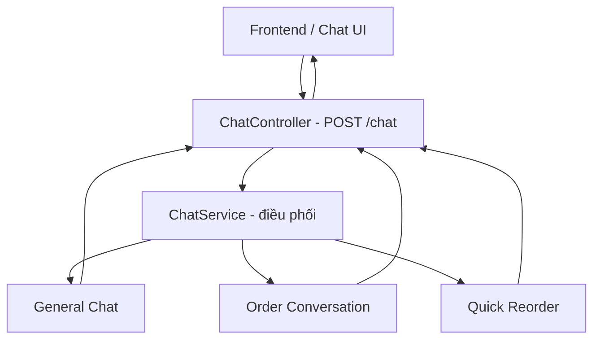

## 2. Request đi qua module

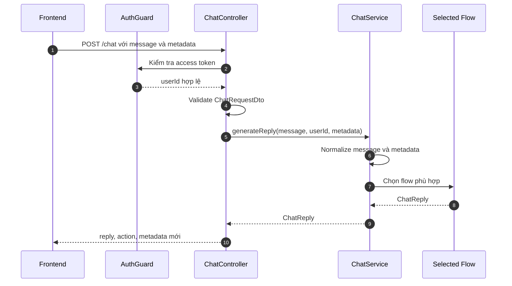

## 3. Quyết định chọn flow

```mermaid
flowchart TD
    Start[Nhận message + metadata]
    Normalize[Trim message và normalize metadata]
    Cancel{Message bằng "hủy"?}
    ReorderStart{Có "đặt lại" hoặc "đơn gần nhất"?}
    ReorderContinue{metadata.isQuickReorder?}
    OrderStart{Có "đặt món" hoặc "đặt đơn"?}
    OrderProgress{Đang trong order flow?}
    CancelReply[Reset metadata và trả cancelOrder]
    ReorderStartFlow[QuickReorderFlow.start]
    ReorderContinueFlow[QuickReorderFlow.continue]
    OrderStartFlow[OrderConversationFlow.start]
    OrderContinue[OrderConversationFlow.continue]
    General[GeneralChatFlow.reply]
    End[Trả ChatReply]

    Start --> Normalize --> Cancel
    Cancel -->|Có| CancelReply --> End
    Cancel -->|Không| ReorderStart
    ReorderStart -->|Có| ReorderStartFlow --> End
    ReorderStart -->|Không| ReorderContinue
    ReorderContinue -->|Có| ReorderContinueFlow --> End
    ReorderContinue -->|Không| OrderStart
    OrderStart -->|Có| OrderStartFlow --> End
    OrderStart -->|Không| OrderProgress
    OrderProgress -->|Có| OrderContinue --> End
    OrderProgress -->|Không| General --> End
```

## 4. General chat flow

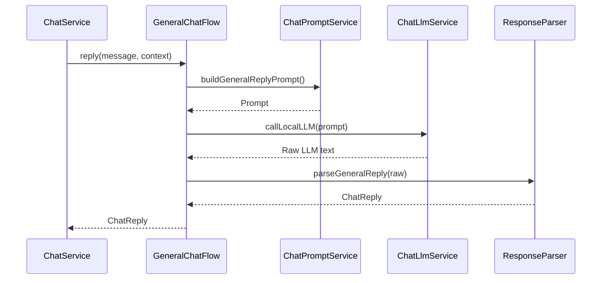

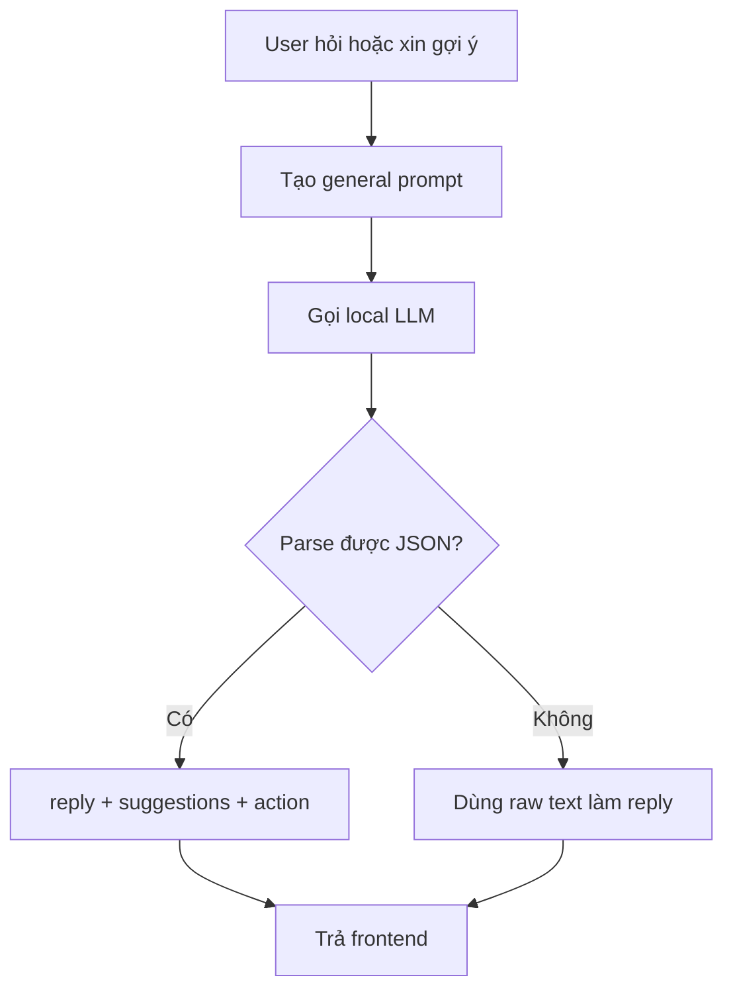

## 5. Order conversation flow

### 5.1. Các bước chính

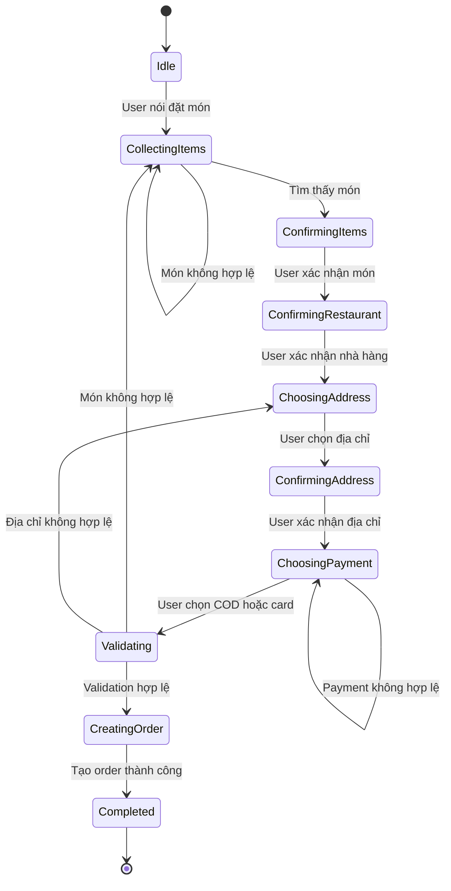

### 5.2. Sequence rút gọn

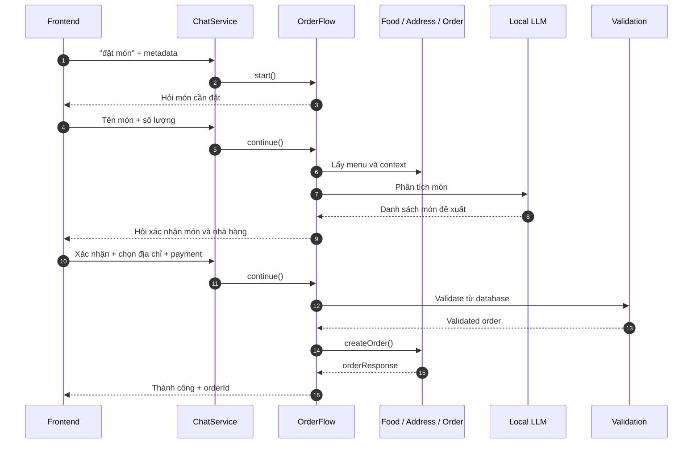

### 5.3. Phân tích món

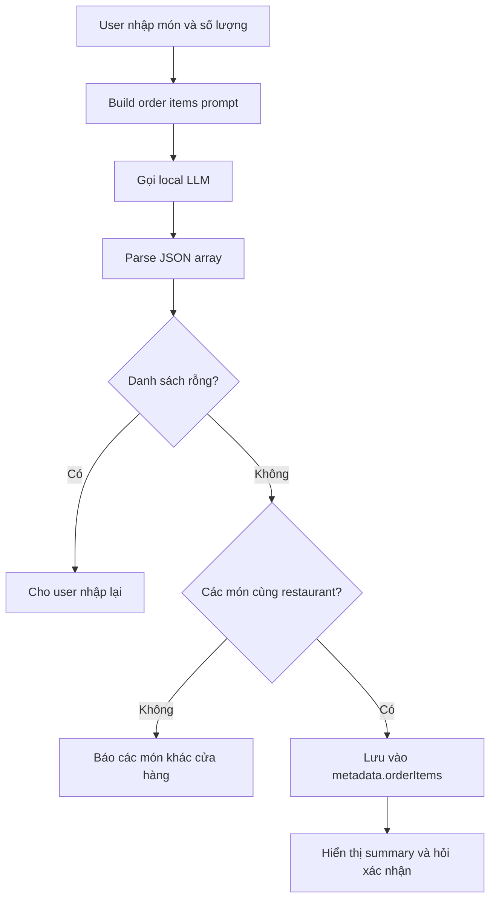

## 6. Quick reorder flow

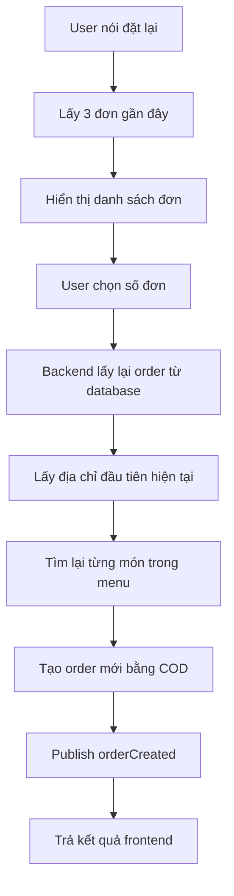

> Implementation hiện tại tự dùng địa chỉ đầu tiên của user và chưa hỏi xác nhận địa chỉ trong quick reorder.

## 7. Validation trước khi tạo order

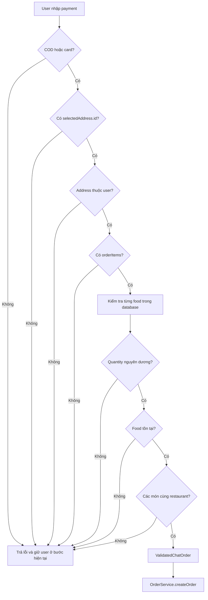

Nguyên tắc:

```txt
LLM / client đề xuất món
        ↓
Backend lấy lại dữ liệu từ database
        ↓
ChatOrderValidationService xác thực
        ↓
OrderService tạo order
```

## 8. Error và fallback

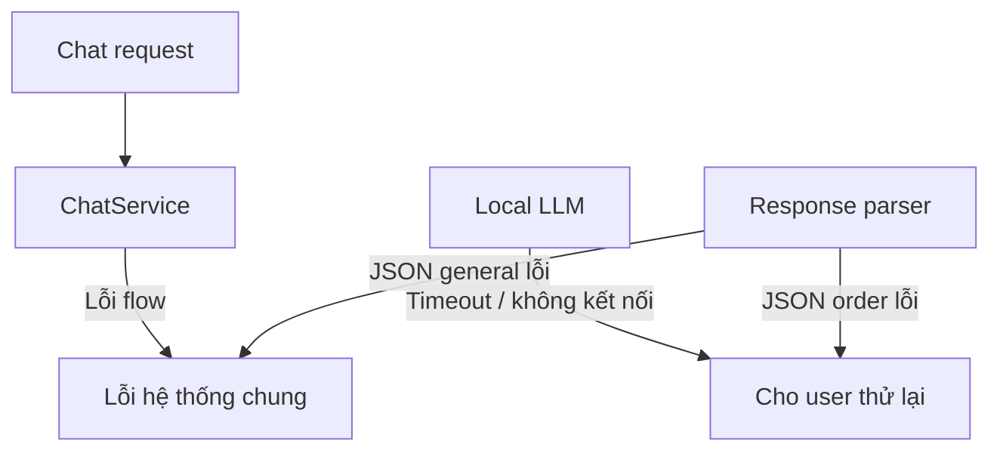

## 9. Bản đồ file

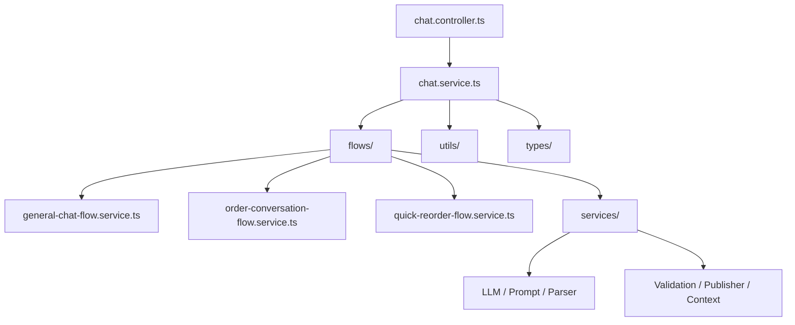

| File | Vai trò |
|---|---|
| `chat.controller.ts` | Nhận `POST /chat`, auth và gọi service |
| `chat.service.ts` | Điều phối và chọn flow |
| `chat.module.ts` | Đăng ký controller, provider và module phụ thuộc |
| `dto/chat-request.dto.ts` | Validate request body |
| `general-chat-flow.service.ts` | Chat/gợi ý món thông thường |
| `order-conversation-flow.service.ts` | Đặt món từng bước |
| `quick-reorder-flow.service.ts` | Đặt lại đơn gần đây |
| `chat-context.service.ts` | Lấy menu và lịch sử order |
| `chat-llm.service.ts` | Gọi local LLM hoặc Gemini |
| `chat-prompt.service.ts` | Tạo prompt cho LLM |
| `chat-response-parser.service.ts` | Parse output LLM |
| `chat-order-validation.service.ts` | Kiểm tra order trước khi tạo |
| `order-created-publisher.service.ts` | Publish event `orderCreated` |
| `chat.types.ts` | Định nghĩa type/interface |
| `chat-metadata.factory.ts` | Tạo và normalize metadata |

## 10. Lưu ý khi đọc flow

1. Metadata hiện do client gửi lại, nên không được tin tuyệt đối.
2. LLM chỉ giúp hiểu ngôn ngữ; backend/database quyết định dữ liệu order hợp lệ.
3. Boolean state có thể mâu thuẫn; về lâu dài nên chuyển sang một field `step`.
4. Quick reorder hiện chọn địa chỉ đầu tiên và chưa hỏi xác nhận địa chỉ.
5. Nên bổ sung test cho các flow trước khi refactor lớn.
