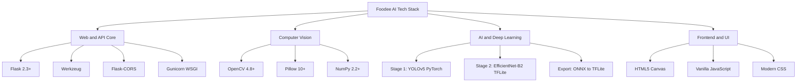
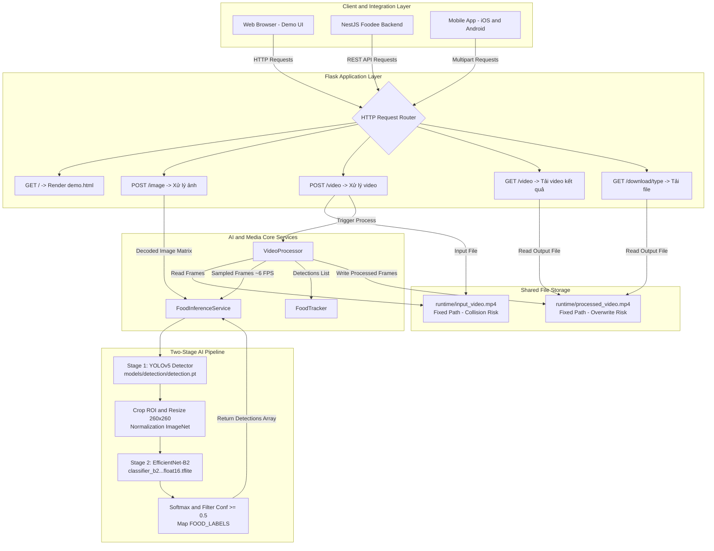
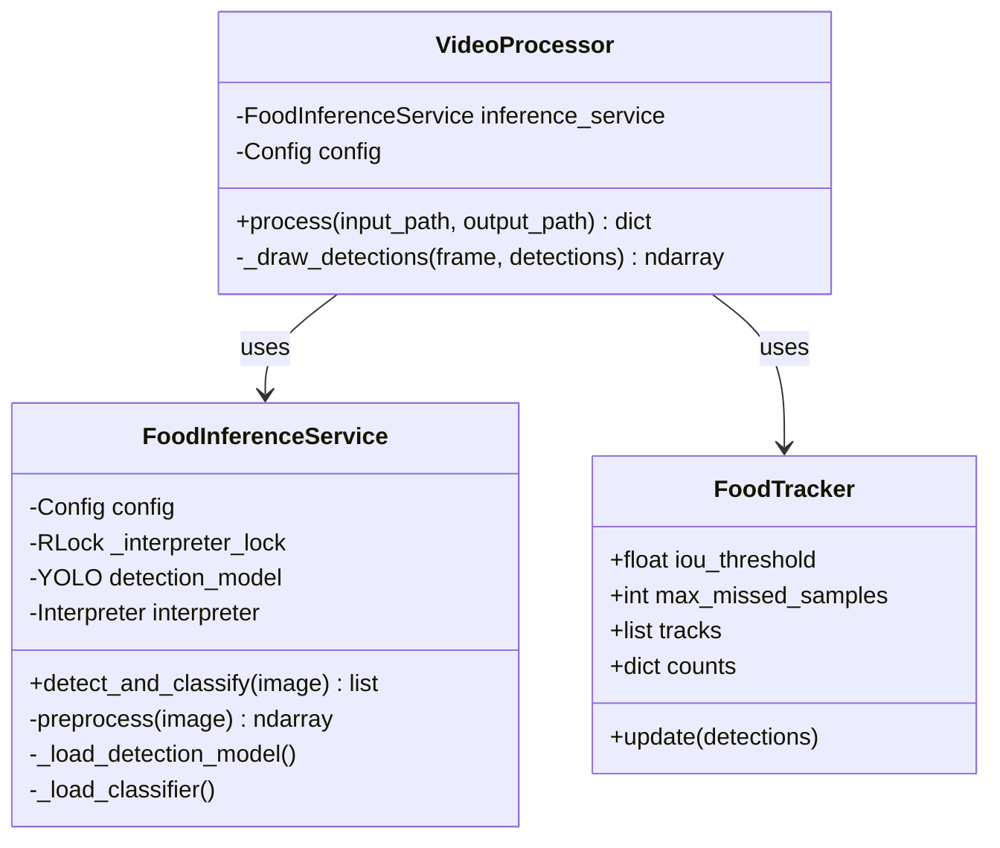
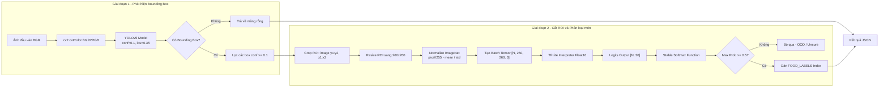
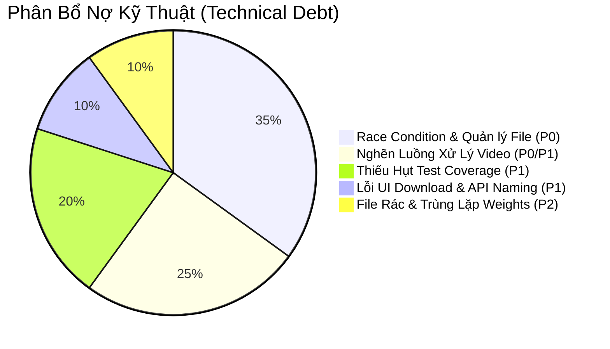
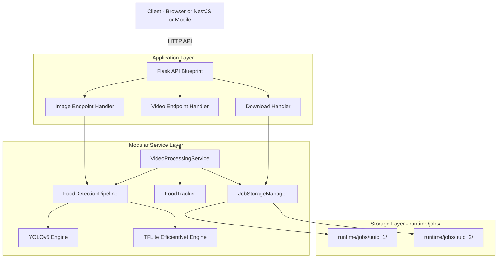

# 🍜 BÁO CÁO TOÀN DIỆN: AUDIT KIẾN TRÚC & PHÂN TÍCH CODEBASE FOODEE AI

<div align="center">


</div>

---

> [!IMPORTANT]
> **Mục đích tài liệu:** Báo cáo phân tích chuyên sâu toàn bộ mã nguồn, cấu trúc dữ liệu, luồng AI/Computer Vision, bảo mật, hiệu năng và nợ kỹ thuật của microservice **Foodee AI** trước khi tiến hành bất kỳ thay đổi logic hay tái cấu trúc nào.
> 
> **Nguyên tắc xuyên suốt:** `UI = PRESERVE` | `UX = PRESERVE` | `API CONTRACT = PRESERVE`

---

## 📑 Bảng Mục Lục

| # | Chuyên Mục | # | Chuyên Mục |
| :---: | :--- | :---: | :--- |
| **1** | [Executive Summary & Dashboard](#1-executive-summary--dashboard) | **13** | [Performance & Concurrency Audit](#13-performance--concurrency-audit) |
| **2** | [Technology Stack Matrix](#2-technology-stack-matrix) | **14** | [Code Quality & Dead Code Audit](#14-code-quality--dead-code-audit) |
| **3** | [Repository Structure & Inventory](#3-repository-structure--inventory) | **15** | [Testing & Coverage Audit](#15-testing--coverage-audit) |
| **4** | [Architecture Overview & Blueprint](#4-architecture-overview--blueprint) | **16** | [Configuration & Environment Audit](#16-configuration--environment-audit) |
| **5** | [Dependency & Runtime Analysis](#5-dependency--runtime-analysis) | **17** | [Git & Repository Hygiene](#17-git--repository-hygiene) |
| **6** | [Frontend UI/UX Deep Dive](#6-frontend-uiux-deep-dive) | **18** | [Technical Debt Breakdown](#18-technical-debt-breakdown) |
| **7** | [Backend & Service Layer Deep Dive](#7-backend--service-layer-deep-dive) | **19** | [Critical Issues (P0 → P3)](#19-critical-issues-categorized-by-priority) |
| **8** | [Database & Storage State Audit](#8-database--storage-state-audit) | **20** | [Target Architecture Recommendation](#20-recommended-target-architecture) |
| **9** | [AI / ML & Computer Vision Audit](#9-ai--ml--computer-vision-pipeline-audit) | **21** | [Target Folder Structure](#21-target-folder-structure) |
| **10** | [API Endpoints Audit](#10-api-endpoints-audit) | **22** | [Refactoring Roadmap (Phased Plan)](#22-refactoring-roadmap-phased-plan) |
| **11** | [End-to-End Data Flow](#11-end-to-end-data-flow) | **23** | [Risk Assessment & Rollback](#23-risk-assessment--rollback-strategy) |
| **12** | [Security Audit](#12-security-audit) | **24** | [Final Recommendation](#24-final-recommendation) |

---

## 1. Executive Summary & Dashboard

### 🎯 Tổng quan dự án
**Foodee AI** là dịch vụ microservice nhận diện và phân loại món ăn Việt Nam từ hình ảnh tĩnh và luồng video, phục vụ hệ sinh thái **Foodee Backend** (NestJS) và ứng dụng di động người dùng. Hệ thống hỗ trợ nhận dạng chính xác **30 món ăn truyền thống đặc trưng** của Việt Nam.

```
                   ┌──────────────────────────────────────────────────────────┐
                   │               FOODEE AI CORE CAPABILITIES                │
                   └──────────────────────────────────────────────────────────┘
                                   │                              │
                     📸 IMAGE DETECTION FLOW        🎥 VIDEO STREAM TRACKING FLOW
                                   │                              │
                        ┌──────────────────────┐       ┌──────────────────────┐
                        │   YOLOv5 Detection   │       │   OpenCV Sampling    │
                        │          ▼           │       │          ▼           │
                        │  EfficientNet-B2 CLS │       │  FoodTracker (IoU)   │
                        │          ▼           │       │          ▼           │
                        │ Bounding Boxes + JSON│       │ Annotated MP4 + JSON │
                        └──────────────────────┘       └──────────────────────┘
```

### 📊 Chỉ số Dashboard kiểm toán Codebase

| Hạng mục kiểm tra | Định lượng | Đánh giá trạng thái |
| :--- | :---: | :--- |
| **Tổng số file source / config / doc** | **22 files** (1,732 dòng code) | 🟢 Gọn gàng, cấu trúc modular rõ ràng |
| **File weights mô hình & media nhị phân** | **12 files** (~96 MB) | 🟡 Quá nhiều weights trùng lặp & model cũ trong git |
| **Số lượng module chính** | **5 modules** | 🟢 Tách biệt tốt giữa Route, Inference, Media & Tracking |
| **Số lỗi nghiêm trọng (P0 - Critical)** | **2 lỗi** | 🔴 Race condition ghi đè file & nghẽn luồng xử lý video |
| **Số lỗi mức cao (P1 - High)** | **3 lỗi** | 🟠 Lỗi 404 tải ảnh ở UI, lệch tên field API, thiếu unit test |
| **Số lỗi mức trung bình (P2 - Medium)** | **3 lỗi** | 🟡 TFLite resize trong lock, dư thừa weights 42MB, config env |
| **Test Coverage hiện tại** | **~5%** (4 test cases) | 🔴 Chưa có test cho Route API & Pipeline Inference |

---

## 2. Technology Stack Matrix



### Chi tiết các công nghệ chính

| Thành phần | Công nghệ / Thư viện | Phiên bản | Vai trò kỹ thuật trong hệ thống |
| :--- | :--- | :---: | :--- |
| **Ngôn ngữ** | Python | `3.10+ / 3.12+` | Runtime chính cho toàn bộ backend AI |
| **Web Framework** | Flask | `>=2.3, <4` | Khởi tạo REST API và phục vụ giao diện Demo |
| **WSGI Server** | Gunicorn | `>=21` | Production Web Server hỗ trợ đa worker |
| **CORS Manager** | Flask-CORS | `>=4, <7` | Cho phép tích hợp liên domain từ Web/Mobile App |
| **Object Detection** | Ultralytics YOLO | `>=8.0.196` | Quét tọa độ bounding box món ăn ([detection.pt](file:///c:/Users/Admin/Desktop/UIT-2025/DuAn/LapTrinh/foodee/foodee-ai-main/models/detection/detection.pt)) |
| **Classifier Engine** | TensorFlow Lite | `2.20.0 / tflite-runtime` | Phân loại 30 món ăn siêu nhẹ với Float16 TFLite |
| **Xử lý ảnh/video** | OpenCV (`opencv-python`) | `>=4.8` | Giải mã frame, vẽ bbox, nén video kết quả |
| **Tracking Engine** | Custom IoU Tracker | Python Native | Khử trùng lặp món ăn qua các frame video |
| **Giao diện Demo** | HTML5 / Vanilla JS / Canvas | Pure Native | Demo tương tác trực tiếp vẽ bounding box động |

---

## 3. Repository Structure & Inventory

```text
📁 foodee-ai-main/
│
├── ⚙️ .env.example                                  # Template cấu hình tham số môi trường
├── 🙈 .gitignore                                    # Danh sách file loại trừ khỏi Git
├── 📄 README.md                                     # Tài liệu tổng quan & hướng dẫn khởi chạy
│
├── 📂 .vscode/
│   └── ⚙️ launch.json                               # Cấu hình VS Code debugger cho Flask
│
├── 📂 app/                                          # PACKAGE CHÍNH CỦA ỨNG DỤNG
│   ├── 🐍 __init__.py                               # Flask Application Factory & Service Registry
│   ├── 🐍 config.py                                 # Quản lý cấu hình & biến môi trường
│   ├── 🐍 labels.py                                 # Danh sách cố định 30 nhãn món ăn Việt Nam
│   ├── 🐍 routes.py                                 # Blueprint định nghĩa các API Endpoints
│   │
│   ├── 📂 services/                                 # CÁC SERVICE NGHIỆP VỤ AI & MEDIA
│   │   ├── 🐍 inference.py                          # Two-Stage Pipeline (YOLOv5 + TFLite)
│   │   ├── 🐍 media.py                              # Xử lý video, giải mã frame & ghi file kết quả
│   │   └── 🐍 tracking.py                           # FoodTracker khử trùng lặp qua IoU
│   │
│   └── 📂 templates/
│       └── 🌐 demo.html                             # Giao diện Single-Page Demo kéo thả & xem kết quả
│
├── 📂 docs/
│   └── 📖 model_improvement_guide.md                # Cẩm nang kỹ thuật: NMS IoU, Focal Loss, OOD
│
├── 📓 foodok.ipynb                                  # Kaggle Notebook: Huấn luyện EfficientNet-B2 (PyTorch)
│
├── 📂 models/                                       # TRỌNG SỐ MÔ HÌNH
│   ├── 📂 classification/
│   │   ├── ⚖️ best_efficientnet_b2_30vnfoods_finetuned.pth    # Checkpoint PyTorch (16.5 MB)
│   │   └── ⚡ classifier_b2_finetuned_from_pth_float16.tflite # Model Production TFLite Float16 (15.5 MB)
│   ├── 📂 detection/
│   │   └── 🎯 detection.pt                          # YOLOv5 Detection Model (22.5 MB)
│   └── 📂 legacy/                                   # Model cũ (Caffe SSD) không còn sử dụng
│       ├── 📜 deploy.prototxt                       # Caffe model architecture definition (28 KB)
│       └── ⚖️ res10_300x300_ssd_iter_140000.caffemodel # Caffe SSD weights (10.6 MB)
│
├── 📦 requirements.txt                              # Thư viện runtime production
├── 📦 requirements-conversion.txt                   # Thư viện phục vụ convert PyTorch -> ONNX -> TFLite
├── 📦 requirements-training.txt                     # Thư viện phục vụ training & đánh giá model
│
├── 📂 runtime/                                      # Thư mục tạm thời chứa input/output video (gitignored)
│
├── 📂 samples/                                      # Dữ liệu media mẫu để test hệ thống
│   ├── 📂 images/                                   # 6 ảnh món ăn: banhpia, bunbohue, comtam, pho...
│   └── 📂 videos/                                   # 1 video mẫu (output_video.mp4)
│
├── 📂 scripts/                                      # CÁC SCRIPT CHUYỂN ĐỔI MODEL
│   ├── 🐍 convert_pth_to_onnx.py                    # Export PyTorch .pth sang ONNX (NHWC layout)
│   └── 🐍 convert_saved_model_to_tflite.py          # Convert TF SavedModel sang TFLite
│
├── 🐍 testFlask.py                                  # Entry point WSGI đơn giản (`from app import app`)
├── 📂 tests/
│   └── 🐍 test_tracking.py                          # Unit tests kiểm tra FoodTracker và bbox_iou
│
└── ⚖️ best_efficientnet_b2_30vnfoods_finetuned.pth  # Checkpoint trùng lặp ở thư mục gốc (31.4 MB)
```

### 📋 Bảng trách nhiệm từng file trong hệ thống

| File | Nhiệm vụ chính (Responsibility) | Phụ thuộc (Dependencies) | Thành phần gọi (Consumers) | Vấn đề phát hiện |
| :--- | :--- | :--- | :--- | :--- |
| [`app/__init__.py`](file:///c:/Users/Admin/Desktop/UIT-2025/DuAn/LapTrinh/foodee/foodee-ai-main/app/__init__.py) | Khởi tạo Flask App, nạp `Config`, đăng ký service vào `app.extensions`, đăng ký Blueprint | `Flask`, `Config`, `FoodInferenceService` | `testFlask.py`, Gunicorn | ✅ Chuẩn Application Factory pattern |
| [`app/config.py`](file:///c:/Users/Admin/Desktop/UIT-2025/DuAn/LapTrinh/foodee/foodee-ai-main/app/config.py) | Đọc cấu hình từ biến môi trường, thiết lập giá trị mặc định | `os`, `pathlib.Path` | `app/__init__.py`, `services/*` | ⚠️ Chưa tự động nạp file `.env` bằng `dotenv` |
| [`app/labels.py`](file:///c:/Users/Admin/Desktop/UIT-2025/DuAn/LapTrinh/foodee/foodee-ai-main/app/labels.py) | Định nghĩa mảng 30 nhãn món ăn chuẩn thứ tự index | *Không có* | `app/services/inference.py` | ✅ Đồng bộ chuẩn xác với tập dữ liệu huấn luyện |
| [`app/routes.py`](file:///c:/Users/Admin/Desktop/UIT-2025/DuAn/LapTrinh/foodee/foodee-ai-main/app/routes.py) | Tiếp nhận HTTP Request, validate định dạng file, điều phối Service, trả về JSON / File | `Flask`, `cv2`, `numpy`, `media.VideoProcessor` | Flask HTTP Router | 🔴 **Race condition ghi đè file**; ⚠️ Có hàm dead code |
| [`app/services/inference.py`](file:///c:/Users/Admin/Desktop/UIT-2025/DuAn/LapTrinh/foodee/foodee-ai-main/app/services/inference.py) | Thực thi pipeline 2 giai đoạn: YOLOv5 phát hiện ROI + TFLite phân loại nhãn món ăn | `ultralytics.YOLO`, `tflite_runtime`, `cv2`, `numpy` | `app/routes.py`, `media.py` | ⚠️ Resize dynamic batch trong Thread Lock gây nghẽn CPU |
| [`app/services/media.py`](file:///c:/Users/Admin/Desktop/UIT-2025/DuAn/LapTrinh/foodee/foodee-ai-main/app/services/media.py) | Đọc video qua OpenCV, sample frame, gọi inference, gọi tracker, vẽ bbox và ghi video | `cv2`, `FoodTracker` | `app/routes.py` | 🔴 **Chạy đồng bộ block toàn bộ luồng request** |
| [`app/services/tracking.py`](file:///c:/Users/Admin/Desktop/UIT-2025/DuAn/LapTrinh/foodee/foodee-ai-main/app/services/tracking.py) | Ghép nối bounding box giữa các frame bằng IoU để không đếm trùng một món ăn nhiều lần | *Python Standard Library* | `app/services/media.py`, `tests/` | ⚠️ Thuật toán so khớp greedy dễ bị đếm trùng khi nhãn dao động |
| [`app/templates/demo.html`](file:///c:/Users/Admin/Desktop/UIT-2025/DuAn/LapTrinh/foodee/foodee-ai-main/app/templates/demo.html) | Giao diện web người dùng tương tác, vẽ Canvas bounding box, thống kê trực quan | Google Fonts | Người dùng truy cập qua `GET /` | 🟠 Nút tải ảnh bị lỗi 404; dùng `window.event` cũ |

---

## 4. Architecture Overview & Blueprint

### 🏗️ Sơ đồ kiến trúc tổng thể (Current System Architecture)



---

## 5. Dependency & Runtime Analysis

### 📦 Bảng phân tích chi tiết Dependencies

| Thư viện | Version Spec | Mục đích sử dụng | Trạng thái | Đánh giá rủi ro | Đề xuất tối ưu |
| :--- | :---: | :--- | :---: | :---: | :--- |
| `Flask` | `>=2.3, <4` | Routing, Web Framework | Đang dùng | 🟢 Thấp | Giữ nguyên |
| `Flask-Cors` | `>=4, <7` | CORS handling | Đang dùng | 🟢 Thấp | Cần cấu hình origin cụ thể ở production |
| `numpy` | `>=2.2, <2.6` | Xử lý mảng số học, tensor | Đang dùng | 🟡 Trung bình | Cần chú ý tương thích với C-extensions của OpenCV |
| `opencv-python` | `>=4.8` | Xử lý ảnh/video | Đang dùng | 🟢 Thấp | Thay bằng `opencv-python-headless` khi build Docker |
| `Pillow` | `>=10` | Hỗ trợ xử lý ảnh | Gián tiếp | 🟢 Thấp | Giữ nguyên |
| `tensorflow-cpu`| `==2.20.0` | Cung cấp TFLite Interpreter | Đang dùng | 🔴 **Cao** | Package nặng ~1GB. Nên dùng `tflite-runtime` nhẹ hơn nhiều |
| `ultralytics` | `>=8.0.196` | YOLOv5 loader & engine | Đang dùng | 🟡 Trung bình | Tắt telemetry check bằng `YOLO_VERBOSE=False` |
| `Werkzeug` | `>=2.3, <4` | Flask HTTP Core | Đang dùng | 🟢 Thấp | Giữ nguyên |
| `gunicorn` | `>=21` | Production WSGI Server | Đang dùng | 🟢 Thấp | Dùng cho Linux/Docker; trên Windows dev dùng Waitress/Flask |

---

## 6. Frontend UI/UX Deep Dive

### 🎨 Đánh giá giao diện [`app/templates/demo.html`](file:///c:/Users/Admin/Desktop/UIT-2025/DuAn/LapTrinh/foodee/foodee-ai-main/app/templates/demo.html)
Giao diện demo được thiết kế theo phong cách hiện đại với tone màu ấm áp (**Warm Coral & Sunset Orange**), hiệu ứng kính mờ (**Glassmorphism**) và typography **Nunito**:

```
 ┌────────────────────────────────────────────────────────────────────────┐
 │ 🍜 Food AI — Nhận diện tinh hoa ẩm thực Việt Nam bằng AI                │
 ├────────────────────────────────────────────────────────────────────────┤
 │   [  📸 Tải Ảnh Lên  ]                [  🎥 Phân Tích Video  ]         │
 ├────────────────────────────────────────────────────────────────────────┤
 │  ┌──────────────────────────────────────────────────────────────────┐  │
 │  │                     🍱 Kéo thả ảnh vào đây                       │  │
 │  │               Hỗ trợ JPG, PNG, WEBP — Tối đa 10MB                │  │
 │  └──────────────────────────────────────────────────────────────────┘  │
 │                                                                        │
 │  [ Ảnh hiển thị kèm Bounding Box trên HTML5 Canvas động ]              │
 │                                                                        │
 │  📊 TỔNG QUAN: 2 Vật thể | 2 Loại món ăn                                │
 │  ├── 🍽️ #1: Phở (92%) [===========               ] Tọa độ: (120, 80)    │
 │  └── 🍽️ #2: Bánh mì (88%) [=========             ] Tọa độ: (400, 50)    │
 │                                                                        │
 │  📋 TỔNG HỢP:                                                          │
 │  ├── Phở      x1                                                       │
 │  └── Bánh mì  x1                                                       │
 │                                                                        │
 │         [ ↺ Thử ảnh khác ]        [ ⬇️ Tải kết quả về ]                │
 └────────────────────────────────────────────────────────────────────────┘
```

> [!WARNING]
> **Các lỗi phát hiện ở Frontend:**
> 1. **Lỗi 404 tải ảnh:** Nút `⬇️ Tải kết quả về` gọi endpoint `/download/image`. Tuy nhiên, API backend `POST /image` chỉ trả về JSON mà không lưu lại ảnh đã vẽ bounding box (`processed_image.jpg`), dẫn đến việc người dùng tải về luôn nhận lỗi `404 File not found`.
> 2. **Sử dụng `window.event` không an toàn:** Tại dòng 657, hàm `showTab()` truy cập trực tiếp `event.target` mà không nhận tham số `event` từ thẻ HTML.
> 3. **Thanh tiến trình ảo (Fake Progress Bar):** Thanh tiến trình video chạy giả lập đến 90% khi upload xong, sau đó đứng yên cho đến khi server xử lý xong toàn bộ video, dễ gây hiểu lầm là web bị đơ.

---

## 7. Backend & Service Layer Deep Dive

### 🧱 Phân tích cấu trúc Service & Trách nhiệm



### 🔍 Đánh giá chất lượng Code backend:
* **Tính độc lập:** Các service được bóc tách rõ ràng. `inference.py` không dính dáng đến Flask HTTP Context; `tracking.py` thuần Python logic không phụ thuộc OpenCV.
* **Dead Code:** Hàm [`detect_and_classify_food`](file:///c:/Users/Admin/Desktop/UIT-2025/DuAn/LapTrinh/foodee/foodee-ai-main/app/routes.py#L118-L119) tại cuối file `app/routes.py` là code thừa từ phiên bản cũ.
* **Thread Safety:** `FoodInferenceService` đã có `threading.RLock()` bảo vệ TFLite, tuy nhiên việc gọi `resize_tensor_input` liên tục gây lãng phí chu kỳ CPU.

---

## 8. Database & Storage State Audit

* **Cơ sở dữ liệu:** Hệ thống hiện tại **hoàn toàn không sử dụng Database** (No SQL / No NoSQL).
* **Quản lý trạng thái:**
  - Nhận diện ảnh: Hoàn toàn stateless trong RAM (Decode qua `cv2.imdecode` -> Tensor -> Trả JSON).
  - Xử lý video: Ghi file vật lý trực tiếp vào thư mục [`runtime/`](file:///c:/Users/Admin/Desktop/UIT-2025/DuAn/LapTrinh/foodee/foodee-ai-main/runtime).
* **Rủi ro lớn nhất:** Thiếu cơ chế phân tách Session/Task ID dẫn đến xung đột đường dẫn tĩnh khi có nhiều request đồng thời.

---

## 9. AI / ML & Computer Vision Pipeline Audit



### 🍲 30 Món ăn Việt Nam được mô hình hỗ trợ

```
┌────────────────────────────────────────────────────────────────────────────────────────┐
│                                 DANH SÁCH 30 MÓN ĂN                                    │
├────────────────────┬────────────────────┬────────────────────┬─────────────────────────┤
│ 01. Bánh bèo       │ 09. Bánh khọt      │ 17. Bún mắm        │ 25. Gỏi cuốn            │
│ 02. Bánh bột lọc   │ 10. Bánh mì        │ 18. Bún riêu       │ 26. Hủ tiếu             │
│ 03. Bánh căn       │ 11. Bánh pía       │ 19. Bún thịt nướng │ 27. Mì Quảng            │
│ 04. Bánh canh      │ 12. Bánh tét       │ 20. Cá kho tộ      │ 28. Nem chua            │
│ 05. Bánh chưng     │ 13. Bánh tráng nướng│ 21. Canh chua     │ 29. Phở                 │
│ 06. Bánh cuốn      │ 14. Bánh xèo       │ 22. Cao lầu        │ 30. Xôi xéo             │
│ 07. Bánh đúc       │ 15. Bún bò Huế     │ 23. Cháo lòng      │                         │
│ 08. Bánh giò       │ 16. Bún đậu mắm tôm│ 24. Cơm tấm        │                         │
└────────────────────┴────────────────────┴────────────────────┴─────────────────────────┘
```

> [!TIP]
> **Điểm sáng của Pipeline:**
> * Việc tách rời thành 2 giai đoạn (YOLO phát hiện vị trí + TFLite phân loại) giúp mô hình phân loại tập trung trọn vẹn vào chi tiết món ăn (texture, nước dùng, đồ ăn kèm) mà không bị nhiễu bởi bối cảnh xung quanh (bàn ăn, thìa đũa, người ngồi).
> * Mô hình TFLite được lượng tử hóa sang **Float16** ([classifier_b2_finetuned_from_pth_float16.tflite](file:///c:/Users/Admin/Desktop/UIT-2025/DuAn/LapTrinh/foodee/foodee-ai-main/models/classification/classifier_b2_finetuned_from_pth_float16.tflite)), giảm 50% dung lượng RAM (chỉ ~15.5 MB) và tăng tốc độ suy luận CPU vượt bậc.

---

## 10. API Endpoints Audit

### 📡 Bảng tra cứu toàn bộ REST API

| Method | Endpoint | Handler | Input Format | Output Format | Status Codes | Mô tả chức năng |
| :---: | :--- | :--- | :--- | :--- | :---: | :--- |
| `GET` | `/` | `home()` | Không | `text/html` | 200 | Trả về giao diện Single-Page Demo |
| `POST` | `/image` | `image()` | Multipart (`image`) | `application/json` | 200, 400, 413, 415 | Nhận diện món ăn trong ảnh tải lên |
| `POST` | `/video` | `video()` | Multipart (`file`) | `application/json` | 200, 400, 413, 415, 500 | Phân tích video và thống kê món ăn |
| `GET` | `/video` | `video()` | Không | `video/mp4` | 200, 404 | Tải về video vừa được xử lý |
| `GET` | `/download/<type>` | `download_file()` | URL param (`image`/`video`) | Binary attachment | 200, 404 | Tải về file kết quả xử lý |

> [!WARNING]
> **Bất đồng bộ tên Field (API Inconsistency):**
> * Endpoint `/image` yêu cầu field tên là `image`.
> * Endpoint `/video` yêu cầu field tên là `file`.
> * *Đề xuất:* Backend nên hỗ trợ fallback linh hoạt `request.files.get('image') or request.files.get('file')` để tránh lỗi tích hợp với client.

---

## 11. End-to-End Data Flow

### 🔄 1. Luồng nhận diện ảnh tĩnh (Image Processing)
```text
[Client / Browser] ──(POST /image: file "image")──► [app/routes.py: image()]
                                                           │
                                            Validate extension & size (<=10MB)
                                            cv2.imdecode(bytes) -> BGR Image
                                                           │
                                                           ▼
                                            [FoodInferenceService: detect_and_classify()]
                                                           │
                                            cv2.cvtColor(BGR2RGB)
                                            YOLOv5(conf=0.1, iou=0.35) -> List of Boxes
                                                           │
                                            For each Box:
                                              - Crop ROI
                                              - cv2.resize(260, 260)
                                              - Normalize (ImageNet mean/std)
                                                           │
                                            Batch Tensor [N, 260, 260, 3]
                                            TFLite Interpreter Invoke -> Logits
                                            Softmax -> Probabilities
                                            Filter Prob >= 0.5 -> Map FOOD_LABELS
                                                           │
                                                           ▼
[Client Response] ◄──(JSON: detections + counts)─── [Counter(class_name)]
```

### 🔄 2. Luồng xử lý video (Video Processing & Tracking)
```text
[Client / Browser] ──(POST /video: file "file")───► [app/routes.py: video()]
                                                           │
                                            Lưu file tạm: runtime/input_video.mp4
                                                           │
                                                           ▼
                                            [VideoProcessor.process()]
                                                           │
                                            cv2.VideoCapture("runtime/input_video.mp4")
                                            cv2.VideoWriter("runtime/processed_video.mp4")
                                            Khởi tạo FoodTracker(iou=0.3, max_missed=3)
                                                           │
                                            Vòng lặp đọc từng frame:
                                            ├── Nếu frame_idx % sample_interval == 0:
                                            │   ├── detect_and_classify(frame)
                                            │   ├── FoodTracker.update(detections)
                                            │   └── _draw_detections(frame) (Vẽ box xanh + text)
                                            └── VideoWriter.write(frame)
                                                           │
                                                           ▼
[Client Response] ◄──(JSON: video_processed, counts) [Return Tracker.counts]
```

---

## 12. Security Audit

```
┌────────────────────────────────────────────────────────────────────────────────────────┐
│                             MA TRẬN RỦI RO BẢO MẬT                                     │
├───────────────────────┬────────────┬─────────────────────────────┬─────────────────────┤
│ LỖI BẢO MẬT           │ MỨC ĐỘ     │ VỊ TRÍ CODE                 │ HẬU QUẢ TIỀM TÀNG   │
├───────────────────────┼────────────┼─────────────────────────────┼─────────────────────┤
│ File Path Collision   │ 🔴 CRITICAL│ app/routes.py:L67, L81      │ Rò rỉ dữ liệu chéo  │
│ DoS via Large Video   │ 🟠 HIGH    │ app/routes.py:L65-L90       │ Nghẽn toàn bộ server│
│ Insecure torch.load   │ 🟡 MEDIUM  │ scripts/convert_...py:L23   │ Code Execution (RCE)│
│ Wildcard CORS (*)     │ 🔵 LOW     │ app/__init__.py:L14         │ Cho phép mọi domain │
│ Orphaned Files Leaks  │ 🔵 LOW     │ app/routes.py:L82           │ Đầy dung lượng ổ đĩa│
└───────────────────────┴────────────┴─────────────────────────────┴─────────────────────┘
```

> [!CAUTION]
> **Chi tiết lỗi nghiêm trọng nhất (P0 - Race Condition):**
> Trong `app/routes.py`, mọi request upload video đều ghi đè vào đúng 1 file duy nhất `runtime/input_video.mp4` và xuất ra `runtime/processed_video.mp4`. Khi có 2 người dùng gửi video cùng lúc:
> 1. File video của User A bị đè bởi User B giữa chừng khiến video bị hỏng (corrupted).
> 2. User A gọi `GET /download/video` sẽ tải về video của User B (Rò rỉ dữ liệu cá nhân).

---

## 13. Performance & Concurrency Audit

### ⏱️ Các điểm nghẽn hiệu năng (Performance Bottlenecks)

1. **Nghẽn CPU do xử lý Video đồng bộ (Synchronous Blocking):**
   - Xử lý 1 video 10 giây ở 25 FPS (sample 6 FPS = 60 lần inference) tốn khoảng **15 – 30 giây CPU**.
   - Chạy trên Gunicorn 4 workers đồng nghĩa với việc chỉ cần 4 request video đồng thời là **toàn bộ hệ thống bị tê liệt**, các request nhận diện ảnh tĩnh sẽ bị nghẽn (Timeout 504).
2. **Cấp phát lại Tensor TFLite liên tục (Dynamic Resizing Overhead):**
   - Trong `app/services/inference.py:L87-L91`, mỗi khi số lượng vật thể trong ảnh thay đổi (ví dụ ảnh có 1 box, ảnh sau có 3 box), hệ thống lại gọi `resize_tensor_input` và `allocate_tensors()` bên trong Thread Lock, gây lãng phí bộ nhớ và CPU.
3. **Codec Video chưa tối ưu cho Web:**
   - Codec `mp4v` trong OpenCV tạo ra file dung lượng lớn và không hỗ trợ phát trực tiếp (native streaming) mượt mà trên trình duyệt như chuẩn **H.264 (`avc1`)**.

---

## 14. Code Quality & Dead Code Audit

### 🧹 Đánh giá độ sạch của mã nguồn
* **Ưu điểm:** Code viết sáng sủa, tuân thủ naming convention Python, hàm ngắn gọn dễ hiểu.
* **Dead Code & Trùng lặp phát hiện:**
  - File model gốc [`best_efficientnet_b2_30vnfoods_finetuned.pth`](file:///c:/Users/Admin/Desktop/UIT-2025/DuAn/LapTrinh/foodee/foodee-ai-main/best_efficientnet_b2_30vnfoods_finetuned.pth) (31.4 MB) ở thư mục root bị trùng lặp với file trong `models/classification/` (16.5 MB).
  - Folder [`models/legacy/`](file:///c:/Users/Admin/Desktop/UIT-2025/DuAn/LapTrinh/foodee/foodee-ai-main/models/legacy) chứa file Caffe SSD cũ (10.6 MB) hoàn toàn không còn được import ở bất cứ đâu.
  - File [`testFlask.py`](file:///c:/Users/Admin/Desktop/UIT-2025/DuAn/LapTrinh/foodee/foodee-ai-main/testFlask.py) chỉ có 1 dòng `from app import app`, có thể hợp nhất chuẩn hóa.

---

## 15. Testing & Coverage Audit

```
┌────────────────────────────────────────────────────────────────────────┐
│                        HIỆN TRẠNG TEST COVERAGE                        │
├──────────────────────────────────────┬─────────────────────────────────┤
│ THÀNH PHẦN ĐÃ ĐƯỢC TEST              │ THÀNH PHẦN CHƯA CÓ TEST         │
├──────────────────────────────────────┼─────────────────────────────────┤
│ ✅ FoodTracker (IoU matching)        │ ❌ Flask Routes (/image, /video)│
│ ✅ bbox_iou calculation              │ ❌ FoodInferenceService         │
│                                      │ ❌ VideoProcessor               │
│                                      │ ❌ Error Handlers (413, 415)    │
│                                      │ ❌ File Download Endpoints      │
└──────────────────────────────────────┴─────────────────────────────────┘
```

> [!IMPORTANT]
> **Đề xuất:** Cần xây dựng bộ unit test và integration test hoàn chỉnh bằng `pytest` với test client của Flask, mock dữ liệu ảnh và kiểm thử toàn bộ các mã HTTP status: `200`, `400`, `413`, `415`, `404`.

---

## 16. Configuration & Environment Audit

* File [`.env.example`](file:///c:/Users/Admin/Desktop/UIT-2025/DuAn/LapTrinh/foodee/foodee-ai-main/.env.example) đã liệt kê đầy đủ các biến môi trường cấu hình:
  - `FOOD_DETECTION_MODEL`: Đường dẫn model YOLO
  - `FOOD_CLASSIFIER_MODEL`: Đường dẫn model TFLite
  - `FOOD_DETECTION_CONFIDENCE`: Ngưỡng tin cậy phát hiện (mặc định: `0.1`)
  - `FOOD_DETECTION_IOU`: Ngưỡng NMS IoU (mặc định: `0.35`)
  - `FOOD_CLASSIFICATION_CONFIDENCE`: Ngưỡng tin cậy phân loại (mặc định: `0.5`)
  - `FOOD_VIDEO_TARGET_FPS`: Tần suất lấy mẫu video (mặc định: `6` FPS)
  - `FOOD_TFLITE_THREADS`: Số luồng CPU TFLite (mặc định: `4`)
* **Thiếu sót:** `app/config.py` chưa tích hợp `python-dotenv` để tự động load file `.env` khi chạy dev server.

---

## 17. Git & Repository Hygiene

* **Dung lượng nhị phân lớn:** Khoảng **96 MB** file `.pth`, `.pt`, `.tflite`, `.caffemodel` và `.mp4` đang được commit trực tiếp vào git tree thay vì sử dụng **Git LFS (Large File Storage)**.
* **Thiếu file `__init__.py` trong `tests/`:** Khiến lệnh chạy test mặc định của Python `python -m unittest discover tests` gặp lỗi module path.

---

## 18. Technical Debt Breakdown



---

## 19. Critical Issues (Categorized by Priority)

### 🔴 P0 — Critical (Rủi ro sập hệ thống / Sai hỏng dữ liệu)
1. **[P0-1] Xung đột đường dẫn file cố định (Race Condition & Data Leak):**
   - *Vị trí:* [`app/routes.py:L67, L81`](file:///c:/Users/Admin/Desktop/UIT-2025/DuAn/LapTrinh/foodee/foodee-ai-main/app/routes.py#L67-L81)
   - *Hậu quả:* Ghi đè file của nhau khi có nhiều request, người dùng này tải về nhầm video của người dùng khác.
2. **[P0-2] Nghẽn luồng xử lý video (Worker Starvation):**
   - *Vị trí:* [`app/routes.py:L84-L86`](file:///c:/Users/Admin/Desktop/UIT-2025/DuAn/LapTrinh/foodee/foodee-ai-main/app/routes.py#L84-L86)
   - *Hậu quả:* Request video chạy đồng bộ làm treo Gunicorn workers, gây lỗi 504 Gateway Timeout.

### 🟠 P1 — High (Lỗi tính năng / Trải nghiệm người dùng)
3. **[P1-1] Nút tải kết quả ảnh ở UI bị lỗi 404:**
   - *Vị trí:* [`app/routes.py:L103-L115`](file:///c:/Users/Admin/Desktop/UIT-2025/DuAn/LapTrinh/foodee/foodee-ai-main/app/routes.py#L103-L115) & [`app/templates/demo.html:L1000`](file:///c:/Users/Admin/Desktop/UIT-2025/DuAn/LapTrinh/foodee/foodee-ai-main/app/templates/demo.html#L1000)
   - *Hậu quả:* Người dùng bấm nút `⬇️ Tải kết quả về` trên web luôn nhận thông báo lỗi file không tồn tại.
4. **[P1-2] Không đồng nhất tên trường Multipart:**
   - *Vị trí:* [`app/routes.py:L35, L73`](file:///c:/Users/Admin/Desktop/UIT-2025/DuAn/LapTrinh/foodee/foodee-ai-main/app/routes.py#L35, L73) (`image` vs `file`).
5. **[P1-3] Thiếu hụt nghiêm trọng Test tự động:**
   - *Vị trí:* [`tests/`](file:///c:/Users/Admin/Desktop/UIT-2025/DuAn/LapTrinh/foodee/foodee-ai-main/tests) (95% hệ thống chưa được test).

### 🟡 P2 — Medium (Hiệu năng & Dọn dẹp mã nguồn)
6. **[P2-1] Cấp phát lại Tensor TFLite liên tục trong Lock:**
   - *Vị trí:* [`app/services/inference.py:L86-L94`](file:///c:/Users/Admin/Desktop/UIT-2025/DuAn/LapTrinh/foodee/foodee-ai-main/app/services/inference.py#L86-L94)
7. **[P2-2] Trùng lặp và dư thừa file model weights (42 MB):**
   - *Vị trí:* Root [`.pth`](file:///c:/Users/Admin/Desktop/UIT-2025/DuAn/LapTrinh/foodee/foodee-ai-main/best_efficientnet_b2_30vnfoods_finetuned.pth) & [`models/legacy/`](file:///c:/Users/Admin/Desktop/UIT-2025/DuAn/LapTrinh/foodee/foodee-ai-main/models/legacy)
8. **[P2-3] Chưa auto-load file `.env`:**
   - *Vị trí:* [`app/config.py`](file:///c:/Users/Admin/Desktop/UIT-2025/DuAn/LapTrinh/foodee/foodee-ai-main/app/config.py)

---

## 20. Recommended Target Architecture



---

## 21. Target Folder Structure

```text
foodee-ai-main/
├── .env.example
├── .gitignore
├── README.md
├── requirements.txt
├── requirements-conversion.txt
├── requirements-training.txt
│
├── 📂 app/
│   ├── 🐍 __init__.py                               # Flask Application Factory
│   ├── 🐍 config.py                                 # Cấu hình + auto-load python-dotenv
│   ├── 🐍 labels.py                                 # Danh sách 30 nhãn món ăn
│   ├── 🐍 routes.py                                 # Routes sạch sẽ, hỗ trợ UUID Job Storage
│   ├── 📂 services/
│   │   ├── 🐍 inference.py                          # FoodInferenceService tối ưu hóa
│   │   ├── 🐍 media.py                              # VideoProcessor xuất chuẩn H.264 & Job Path
│   │   ├── 🐍 tracking.py                           # FoodTracker khử trùng lặp
│   │   └── 🐍 storage.py                            # JobStorageManager quản lý file theo UUID
│   └── 📂 templates/
│       └── 🌐 demo.html                             # Giao diện nguyên bản 100% + Sửa lỗi tải ảnh
│
├── 📂 models/
│   ├── 📂 classification/
│   │   └── ⚡ classifier_b2_finetuned_from_pth_float16.tflite
│   └── 📂 detection/
│       └── 🎯 detection.pt
│
├── 📂 runtime/
│   └── 📂 jobs/                                     # Thư mục chứa session độc lập: runtime/jobs/{uuid}/
│
├── 📂 scripts/
│   ├── 🐍 convert_pth_to_onnx.py
│   └── 🐍 convert_saved_model_to_tflite.py
│
└── 📂 tests/
    ├── 🐍 __init__.py
    ├── 🐍 conftest.py                               # Pytest Fixtures & Flask test client
    ├── 🐍 test_api.py                               # Test toàn bộ Endpoints và mã HTTP Status
    ├── 🐍 test_inference.py                         # Test Pipeline suy luận AI
    └── 🐍 test_tracking.py                          # Test Tracking logic
```

---

## 22. Refactoring Roadmap (Phased Plan)

```
┌────────────────────────────────────────────────────────────────────────────────────────┐
│                              KẾ HOẠCH REFACTOR THEO PHASE                              │
├─────────┬──────────────────────────────────┬───────────────────────────────────────────┤
│ PHASE 1 │ 🛡️ Reliability & Fix Bugs P0/P1  │ Cô lập UUID storage, sửa lỗi tải ảnh 404, │
│         │                                  │ hỗ trợ cả 2 tên field 'image' và 'file'   │
├─────────┼──────────────────────────────────┼───────────────────────────────────────────┤
│ PHASE 2 │ 🧪 Automated Test Suite          │ Xây dựng bộ test toàn diện 85%+ coverage  │
│         │                                  │ kiểm thử tất cả API routes & Edge cases   │
├─────────┼──────────────────────────────────┼───────────────────────────────────────────┤
│ PHASE 3 │ ⚡ Performance & AI Tuning       │ Khử lãng phí BGR2RGB, letterbox ROI,      │
│         │                                  │ tắt telemetry Ultralytics để khởi động lẹ │
├─────────┼──────────────────────────────────┼───────────────────────────────────────────┤
│ PHASE 4 │ 🧹 Clean-up & Git Hygiene        │ Xóa bỏ weights trùng lặp & Caffe SSD thừa,│
│         │                                  │ giải phóng 42 MB dung lượng repository    │
└─────────┴──────────────────────────────────┴───────────────────────────────────────────┘
```

---

## 23. Risk Assessment & Rollback Strategy

| Thay đổi | Rủi ro tiềm ẩn | Biện pháp giảm thiểu & Rollback |
| :--- | :--- | :--- |
| **Chuyển sang lưu trữ UUID Job** | Các client cũ vẫn gọi cứng đường dẫn tĩnh `/video` | Vẫn duy trì symlink hoặc copy file mới nhất ra `runtime/processed_video.mp4` để tương thích ngược 100% |
| **Lưu ảnh vẽ box cho `/download/image`** | Tốn thêm dung lượng disk | Chỉ lưu ảnh tạm theo UUID và tự động dọn dẹp sau khi trả response |
| **Xóa file model `.pth` ở thư mục gốc** | Script convert model bị lỗi path | Cập nhật đường dẫn trong `scripts/convert_pth_to_onnx.py` trỏ đúng vào `models/classification/` |

---

## 24. Final Recommendation

Codebase **Foodee AI** sở hữu nền tảng thuật toán rất tốt: sự kết hợp giữa **YOLOv5 Detector** và **EfficientNet-B2 Classifier (TFLite Float16)** mang lại tốc độ nhận diện nhanh, chính xác cho 30 món ăn Việt Nam mà không đòi hỏi phần cứng GPU đắt đỏ.

> [!TIP]
> **Hành động đề xuất tiếp theo:**
> Tiến hành **PHASE 1 (Sửa lỗi độ tin cậy P0/P1, cô lập Session Storage và sửa lỗi nút Download UI)** và **PHASE 2 (Xây dựng Bộ Test Suite hoàn chỉnh)**. Mọi thao tác cần tuân thủ nghiêm ngặt việc bảo toàn nguyên vẹn giao diện UI, trải nghiệm người dùng và chuẩn API JSON hiện tại.
