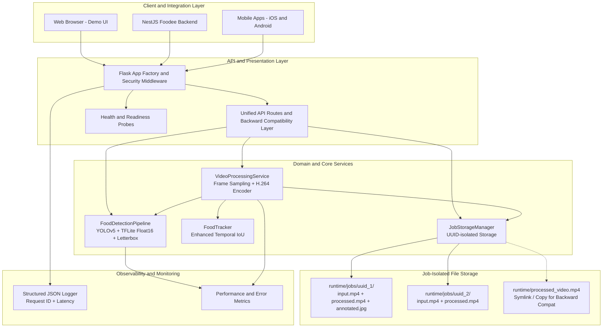
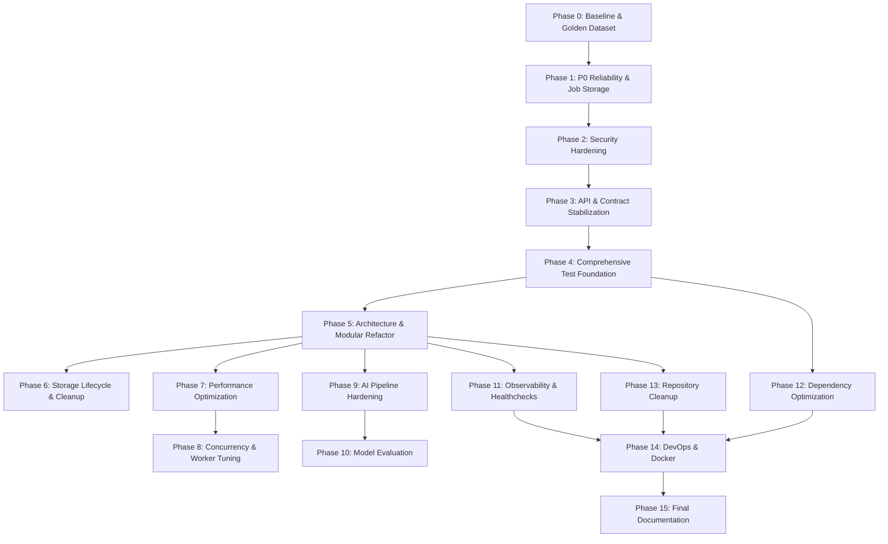
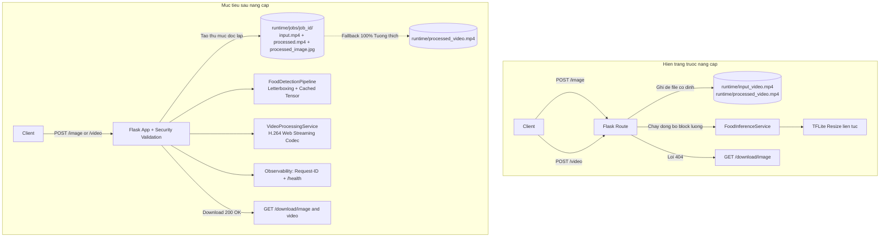
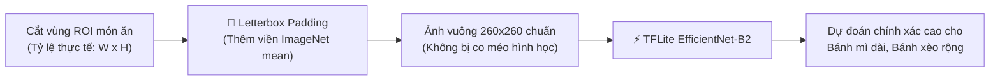

# 🚀 KẾ HOẠCH NÂNG CẤP TOÀN DIỆN HỆ THỐNG FOODEE AI
## MASTER PROJECT UPGRADE ROADMAP & IMPLEMENTATION SPECIFICATION

<div align="center">


</div>

---

> [!IMPORTANT]
> **TÔN CHỈ XUYÊN SUỐT TOÀN BỘ TIẾN TRÌNH NÂNG CẤP:**
> ```text
> 1. UI = PRESERVE (Bảo toàn 100% giao diện, CSS màu sắc, typography Nunito, canvas vẽ box)
> 2. UX = PRESERVE (Bảo toàn luồng người dùng kéo thả, xem kết quả, tải file, tabs)
> 3. API CONTRACT = PRESERVE (Bảo toàn cấu trúc JSON trả về cho NestJS Backend & Mobile App)
> 4. BUSINESS BEHAVIOR = PRESERVE (Bảo toàn độ chính xác và thống kê 30 món ăn Việt Nam)
> 5. ZERO BIG-BANG REWRITE (Chuyển đổi từng bước an toàn qua Test bảo vệ, không đập đi xây lại)
> ```

---

## 📑 MỤC LỤC CHI TIẾT

| Phần | Nội dung | Phần | Nội dung |
| :---: | :--- | :---: | :--- |
| **1** | [Executive Summary](#1-executive-summary) | **10** | [Security Strategy](#10-security-strategy) |
| **2** | [Current State Analysis](#2-current-state-analysis) | **11** | [Performance & Concurrency Strategy](#11-performance--concurrency-strategy) |
| **3** | [Target State Architecture](#3-target-state-architecture) | **12** | [AI / ML Pipeline Hardening Strategy](#12-ai--ml-pipeline-hardening-strategy) |
| **4** | [Major Problems & Root Causes](#4-major-problems--root-causes) | **13** | [Observability & Diagnostics Strategy](#13-observability--diagnostics-strategy) |
| **5** | [Upgrade Principles & Quality Gates](#5-upgrade-principles--quality-gates) | **14** | [DevOps & Containerization Strategy](#14-devops--containerization-strategy) |
| **6** | [Detailed Phase-by-Phase Roadmap](#6-detailed-phase-by-phase-roadmap) | **15** | [Risk Matrix & Mitigation](#15-risk-matrix--mitigation) |
| **7** | [Phase Dependency Graph](#7-phase-dependency-graph) | **16** | [Regression Matrix](#16-regression-matrix) |
| **8** | [Architecture Migration Blueprint](#8-architecture-migration-blueprint) | **17** | [Definition of Done (DoD)](#17-definition-of-done-dod) |
| **9** | [Testing Strategy & Golden Tests](#9-testing-strategy--golden-tests) | **18** | [Final Execution Order & Next Step](#18-final-execution-order--next-step) |

---

## 1. Executive Summary

Microservice **Foodee AI** là thành phần quan trọng trong bài toán thị giác máy tính của hệ sinh thái **Foodee**, chịu trách nhiệm phát hiện và phân loại **30 món ăn Việt Nam** thông qua pipeline 2 giai đoạn: **YOLOv5 Detector** kết hợp **EfficientNet-B2 Classifier (TFLite Float16)**.

Báo cáo kiểm toán [PROJECT_CODEBASE_AUDIT.md](file:///c:/Users/Admin/Desktop/UIT-2025/DuAn/LapTrinh/foodee/foodee-ai-main/PROJECT_CODEBASE_AUDIT.md) cho thấy hệ thống có thuật toán AI cốt lõi tốt nhưng đang đối mặt với các vấn đề nghiêm trọng về **độ tin cậy đa người dùng (Concurrency Race Condition)**, **nghẽn luồng xử lý video (Worker Starvation)**, **lỗi giao diện tải ảnh 404**, và **thiếu hụt test tự động**.

Tài liệu này xác lập lộ trình gồm **15 Phase tuần tự** nhằm nâng cấp toàn diện hệ thống từ trạng thái hiện tại (Proof of Concept) thành một dịch vụ cấp **Production-Ready** đạt chuẩn ổn định, an toàn, hiệu năng cao và có khả năng quan sát (Observability), cam kết **không làm gián đoạn hay thay đổi bất kỳ hành vi người dùng và hợp đồng API nào**.

---

## 2. Current State Analysis

```
┌─────────────────────────────────────────────────────────────────────────────────────────┐
│                              CURRENT STATE ARCHITECTURE                                  │
├─────────────────────────────────────────────────────────────────────────────────────────┤
│                                                                                         │
│  [ Web Browser / NestJS / Mobile ]                                                      │
│                 │                                                                       │
│                 ▼                                                                       │
│  ┌───────────────────────────────┐                                                      │
│  │     Flask Blueprint Routes    │                                                      │
│  │      (app/routes.py)          │                                                      │
│  └──────────────┬────────────────┘                                                      │
│                 │                                                                       │
│        ┌────────┴─────────────────────────────────┐                                     │
│        ▼                                          ▼                                     │
│  ┌──────────────────────────────┐        ┌──────────────────────────────┐               │
│  │   FoodInferenceService       │        │       VideoProcessor         │               │
│  │  (app/services/inference.py) │        │   (app/services/media.py)    │               │
│  └──────────────┬───────────────┘        └──────────────┬───────────────┘               │
│                 │                                       │                               │
│        ┌────────┴────────┐                              ▼                               │
│        ▼                 ▼               ┌──────────────────────────────┐               │
│  ┌───────────┐    ┌─────────────┐        │     Shared File Storage      │               │
│  │  YOLOv5   │    │ TFLite B2   │        │ ⚠️ runtime/input_video.mp4   │               │
│  │ (.pt)     │    │ (float16)   │        │ ⚠️ runtime/processed_video.mp4│               │
│  └───────────┘    └─────────────┘        └──────────────────────────────┘               │
│                                                                                         │
└─────────────────────────────────────────────────────────────────────────────────────────┘
```

### Tổng hợp hiện trạng kỹ thuật:
* **Framework:** Flask 2.3.3 + Flask-CORS 4.0.0.
* **Storage Model:** Thư mục đơn lẻ `runtime/` với tên file cố định (`input_video.mp4`, `processed_video.mp4`).
* **Concurrency:** Sử dụng `threading.RLock()` bảo vệ TFLite, nhưng liên tục gọi `resize_tensor_input` và `allocate_tensors()` khi kích thước batch thay đổi.
* **Video Flow:** Chạy trực tiếp đồng bộ trong HTTP thread của Flask, chiếm dụng worker Gunicorn từ 15 đến 45 giây/video.
* **API Endpoints:** `POST /image` (field: `image`), `POST /video` (field: `file`), `GET /video`, `GET /download/<file_type>`, `GET /`.
* **Testing:** Chỉ có 4 unit tests cho `FoodTracker` trong `tests/test_tracking.py`. 0% coverage cho Route và Pipeline.

---

## 3. Target State Architecture



### Điểm nổi bật của Target State:
1. **Cô lập dữ liệu theo Job ID (UUIDv4):** Mỗi request tạo một thư mục độc lập `runtime/jobs/{job_id}/`, triệt tiêu hoàn toàn xung đột ghi đè.
2. **Khả năng tương thích ngược tuyệt đối:** Vẫn duy trì fallback file ra `runtime/processed_video.mp4` để các client cũ không bị ảnh hưởng.
3. **Pipeline suy luận tối ưu:** Cố định bộ nhớ tensor TFLite, bổ sung letterboxing bảo toàn tỷ lệ khung hình cho món ăn.
4. **Hệ thống Test bảo vệ đa tầng:** Unit test, API integration test, và Golden dataset test kiểm tra hồi quy sau mỗi thay đổi.

---

## 4. Major Problems & Root Causes

```text
┌────────────────────────────────────────────────────────────────────────────────────────┐
│                              ROOT CAUSE ANALYSIS TABLE                                 │
├────┬─────────────────────────────┬───────────────────────────┬────────────────────────┤
│ ID │ VẤN ĐỀ HIỆN TẠI             │ NGUYÊN NHÂN GỐC RỄ        │ HẬU QUẢ KỸ THUẬT       │
├────┼─────────────────────────────┼───────────────────────────┼────────────────────────┤
│ P01│ Race condition ghi đè video │ Hardcoded static path     │ File hỏng, rò rỉ chéo  │
│ P02│ Treo worker khi xử lý video │ Synchronous in HTTP thread│ Worker starvation (504)│
│ P11│ Nút tải ảnh ở UI bị 404     │ POST /image không lưu file│ Lỗi tính năng trên web │
│ P12│ Lệch tên field API          │ 'image' vs 'file'         │ Lỗi tích hợp client    │
│ P13│ Thiếu test tự động          │ Chưa xây dựng test suite  │ Rủi ro cao khi sửa code│
│ P21│ Dynamic resize TFLite       │ Re-allocate mỗi batch     │ Tăng latency CPU       │
│ P22│ Dư thừa 42MB weights        │ File checkpoint lặp trong │ Tăng kích thước Docker │
│ P23│ Chưa auto-load .env         │ Thiếu python-dotenv       │ Bất tiện khi deploy    │
└────┴─────────────────────────────┴───────────────────────────┴────────────────────────┘
```

---

## 5. Upgrade Principles & Quality Gates

Mọi thay đổi code trong từng Phase bắt buộc phải vượt qua **4 Cổng chất lượng (Quality Gates)**:

```
┌─────────────────┐    ┌─────────────────┐    ┌─────────────────┐    ┌─────────────────┐
│  QUALITY GATE 1 │    │  QUALITY GATE 2 │    │  QUALITY GATE 3 │    │  QUALITY GATE 4 │
│   Unit Tests    │───►│ Integration Test│───►│ Golden Dataset  │───►│ Performance &   │
│   (100% Pass)   │    │  (Status Codes) │    │(Zero Regression)│    │ Security Audit  │
└─────────────────┘    └─────────────────┘    └─────────────────┘    └─────────────────┘
```

---

## 6. Detailed Phase-by-Phase Roadmap

---

### 🔹 PHASE 0: Baseline & Golden Dataset Establishment

* **Mục tiêu:** Thiết lập baseline có thể tái lập (Reproducible Baseline) ghi nhận chính xác hành vi, độ trễ, mức tiêu thụ tài nguyên và output mẫu của hệ thống hiện tại trước khi can thiệp mã nguồn.
* **Tại sao làm trước:** Cung cấp dữ liệu đối chiếu ("Golden Truth") để chứng minh hệ thống không bị hồi quy (Regression) sau khi refactor.
* **Files bị ảnh hưởng:** Tạo file mới `tests/golden_dataset.json`, tài liệu hóa `docs/BASELINE.md`.
* **Kế hoạch thực hiện:**
  - **Task 0.1:** Đo đạc và ghi nhận tài nguyên khởi động: Python version, RAM baseline, thời gian nạp model.
  - **Task 0.2:** Chạy 6 ảnh mẫu trong `samples/images/` qua `POST /image`, lưu toàn bộ output JSON và bounding box vào `tests/golden_dataset.json`.
  - **Task 0.3:** Chạy video mẫu `samples/videos/output_video.mp4` qua `POST /video`, lưu số lượng đếm món ăn chuẩn.
  - **Task 0.4:** Ghi nhận baseline độ trễ (P50, P95 latency) cho ảnh và video.
* **Rủi ro:** Không có rủi ro (Chỉ đo lường, không sửa code).
* **Definition of Done:** Có file `docs/BASELINE.md` và `tests/golden_dataset.json` hoàn chỉnh.

---

### 🔹 PHASE 1: P0 Reliability & Job Storage Isolation

* **Mục tiêu:** Xóa bỏ triệt để rủi ro Race Condition, ghi đè file và rò rỉ dữ liệu chéo giữa các người dùng đồng thời.
* **Tại sao làm trước:** Đây là lỗi nghiêm trọng nhất (P0) có thể làm hỏng dữ liệu và sai lệch kết quả người dùng.
* **Files bị ảnh hưởng:**
  - Tạo mới: [`app/services/storage.py`](file:///c:/Users/Admin/Desktop/UIT-2025/DuAn/LapTrinh/foodee/foodee-ai-main/app/services/storage.py) (`JobStorageManager`)
  - Sửa đổi: [`app/routes.py`](file:///c:/Users/Admin/Desktop/UIT-2025/DuAn/LapTrinh/foodee/foodee-ai-main/app/routes.py), [`app/services/media.py`](file:///c:/Users/Admin/Desktop/UIT-2025/DuAn/LapTrinh/foodee/foodee-ai-main/app/services/media.py)
* **Kế hoạch chi tiết:**
  - **Task 1.1:** Xây dựng `JobStorageManager` tạo thư mục làm việc độc lập `runtime/jobs/{job_id}/` (dùng `uuid.uuid4()`).
  - **Task 1.2:** Cập nhật `POST /video` lưu video vào `runtime/jobs/{job_id}/input.mp4` và xuất ra `runtime/jobs/{job_id}/processed.mp4`.
  - **Task 1.3:** Tạo cơ chế tương thích ngược (Backward-Compatible Fallback): Copy hoặc symlink video mới nhất ra `runtime/processed_video.mp4` để không làm gãy endpoint `GET /video`.
  - **Task 1.4:** Cập nhật `POST /image` lưu ảnh kèm bounding box vào `runtime/jobs/{job_id}/processed_image.jpg` và copy vào `runtime/processed_image.jpg` để **sửa dứt điểm lỗi 404 của nút download trên UI**.
* **Rủi ro:** Khách hàng cũ gọi `GET /video` có thể không tìm thấy file nếu không có fallback.
* **Biện pháp giảm thiểu:** Luôn duy trì đồng bộ ra `runtime/processed_video.mp4`.
* **Definition of Done:** 5 request video/image đồng thời không ghi đè dữ liệu của nhau; `GET /download/image` trả về HTTP 200 kèm ảnh hợp lệ.

---

### 🔹 PHASE 2: Security Hardening & Input Sanitization

* **Mục tiêu:** Khóa chặt các lỗ hổng bảo mật: Upload file độc hại, Path Traversal, DoS dung lượng, Deserialization không an toàn.
* **Files bị ảnh hưởng:**
  - [`app/routes.py`](file:///c:/Users/Admin/Desktop/UIT-2025/DuAn/LapTrinh/foodee/foodee-ai-main/app/routes.py), [`app/config.py`](file:///c:/Users/Admin/Desktop/UIT-2025/DuAn/LapTrinh/foodee/foodee-ai-main/app/config.py), [`scripts/convert_pth_to_onnx.py`](file:///c:/Users/Admin/Desktop/UIT-2025/DuAn/LapTrinh/foodee/foodee-ai-main/scripts/convert_pth_to_onnx.py).
* **Kế hoạch chi tiết:**
  - **Task 2.1 (Magic Bytes Validation):** Kiểm tra Header nhị phân thực tế của file ảnh (JPEG `FF D8 FF`, PNG `89 50 4E 47`, WEBP `52 49 46 46`) thay vì chỉ nhìn đuôi mở rộng `.jpg`.
  - **Task 2.2 (Path Traversal Protection):** Dùng `werkzeug.utils.secure_filename` và cấm hoàn toàn ký tự `..` hoặc `/` trong `file_type`.
  - **Task 2.3 (Safe Model Loading):** Cập nhật `scripts/convert_pth_to_onnx.py` chuyển sang `torch.load(..., weights_only=True)`.
  - **Task 2.4 (CORS Restriction):** Cho phép cấu hình danh sách domain được phép truy cập qua `FOOD_ALLOWED_ORIGINS` trong `.env`.
* **Definition of Done:** Upload file đuôi `.jpg` nhưng nội dung là script PHP/Shell bị từ chối với HTTP 415.

---

### 🔹 PHASE 3: API & Contract Stabilization

* **Mục tiêu:** Chuẩn hóa giao diện API, hỗ trợ cả 2 tên trường `image` và `file`, chuẩn hóa JSON Error Response mà không làm đổi format output thành công.
* **Files bị ảnh hưởng:** [`app/routes.py`](file:///c:/Users/Admin/Desktop/UIT-2025/DuAn/LapTrinh/foodee/foodee-ai-main/app/routes.py), [`app/__init__.py`](file:///c:/Users/Admin/Desktop/UIT-2025/DuAn/LapTrinh/foodee/foodee-ai-main/app/__init__.py).
* **Kế hoạch chi tiết:**
  - **Task 3.1 (Multipart Fallback):** Cả 2 endpoint `/image` và `/video` đều chấp nhận field `image` hoặc `file`:
    ```python
    uploaded_file = request.files.get('image') or request.files.get('file')
    ```
  - **Task 3.2 (Unified Error JSON):** Định nghĩa chuẩn response lỗi thống nhất:
    ```json
    { "success": false, "error": "Chi tiết lỗi", "code": "INVALID_FILE_FORMAT" }
    ```
  - **Task 3.3 (Global Error Handlers):** Bổ sung error handler cho `400`, `404`, `405`, `413`, `415`, `500` luôn trả về JSON thay vì trang HTML mặc định của Flask.
* **Definition of Done:** Gửi request với field `image` hay `file` đều chạy thành công; mọi lỗi đều trả về JSON đúng chuẩn HTTP Status.

---

### 🔹 PHASE 4: Comprehensive Test Foundation

* **Mục tiêu:** Xây dựng mạng lưới an toàn (Safety Net) với độ bao phủ test >= 85%, đảm bảo không có bất kỳ regression nào xảy ra trong các phase tiếp theo.
* **Files bị ảnh hưởng:**
  - Tạo mới: [`tests/__init__.py`](file:///c:/Users/Admin/Desktop/UIT-2025/DuAn/LapTrinh/foodee/foodee-ai-main/tests/__init__.py), [`tests/conftest.py`](file:///c:/Users/Admin/Desktop/UIT-2025/DuAn/LapTrinh/foodee/foodee-ai-main/tests/conftest.py), [`tests/test_api.py`](file:///c:/Users/Admin/Desktop/UIT-2025/DuAn/LapTrinh/foodee/foodee-ai-main/tests/test_api.py), [`tests/test_inference.py`](file:///c:/Users/Admin/Desktop/UIT-2025/DuAn/LapTrinh/foodee/foodee-ai-main/tests/test_inference.py), [`tests/test_storage.py`](file:///c:/Users/Admin/Desktop/UIT-2025/DuAn/LapTrinh/foodee/foodee-ai-main/tests/test_storage.py).
* **Kế hoạch chi tiết:**
  - **Task 4.1:** Thiết lập Pytest fixtures (`app`, `client`, `mock_inference`, `sample_image_bytes`).
  - **Task 4.2 (API Route Tests):** Test đầy đủ các kịch bản thành công và thất bại cho `POST /image`, `POST /video`, `GET /video`, `GET /download/<file_type>`, `GET /`.
  - **Task 4.3 (Inference Service Tests):** Test hàm `detect_and_classify` với ảnh rỗng, ảnh không có món ăn, ảnh có nhiều món ăn.
  - **Task 4.4 (Storage Tests):** Test tạo job ID, lưu file, dọn dẹp file theo TTL.
* **Definition of Done:** Toàn bộ test suite chạy bằng lệnh `pytest tests/` đạt **100% Pass** trong thời gian < 10 giây.

---

### 🔹 PHASE 5: Architecture & Modular Refactoring

* **Mục tiêu:** Tách các module gọn gàng theo chuẩn kiến trúc dịch vụ sạch (Clean Layered Microservice), loại bỏ dead code, tuân thủ SOLID.
* **Files bị ảnh hưởng:**
  - Sắp xếp lại cấu trúc: `app/routes.py`, `app/services/inference.py`, `app/services/media.py`.
  - Xóa bỏ dead code: Hàm `detect_and_classify_food` ở cuối `app/routes.py`.
* **Kế hoạch chi tiết:**
  - **Task 5.1:** Tách `app/routes.py` thành các blueprint con nếu cần hoặc tổ chức lại handler rõ ràng, loại bỏ toàn bộ code cũ không dùng.
  - **Task 5.2 (Dependency Injection):** Truyền `StorageManager` và `InferenceService` vào `VideoProcessor` thông qua constructor thay vì phụ thuộc ẩn.
  - **Task 5.3:** Tối ưu hóa việc import module (lazy import hoặc tập trung).
* **Definition of Done:** Mã nguồn sạch, không còn dead code, tất cả unit test Phase 4 đều pass.

---

### 🔹 PHASE 6: Storage Lifecycle & Auto-Cleanup Management

* **Mục tiêu:** Ngăn chặn việc tràn đĩa cứng (Disk Full) do file tạm video/ảnh tích tụ lâu ngày trong `runtime/`.
* **Files bị ảnh hưởng:** [`app/services/storage.py`](file:///c:/Users/Admin/Desktop/UIT-2025/DuAn/LapTrinh/foodee/foodee-ai-main/app/services/storage.py), [`app/config.py`](file:///c:/Users/Admin/Desktop/UIT-2025/DuAn/LapTrinh/foodee/foodee-ai-main/app/config.py).
* **Kế hoạch chi tiết:**
  - **Task 6.1 (TTL Cleanup):** Bổ sung hàm `cleanup_old_jobs(max_age_seconds=3600)` xóa các thư mục job quá 1 giờ tuổi.
  - **Task 6.2 (Post-Process Cleanup):** Trong `routes.py`, tự động dọn dẹp file `input.mp4` sau khi video đã xử lý xong và chỉ giữ lại `processed.mp4`.
* **Definition of Done:** Các job cũ hơn 1 giờ tự động được thu hồi dung lượng đĩa an toàn.

---

### 🔹 PHASE 7: Performance & Latency Optimization

* **Mục tiêu:** Giảm thời gian xử lý ảnh/video, giảm lãng phí CPU và bộ nhớ.
* **Files bị ảnh hưởng:** [`app/services/inference.py`](file:///c:/Users/Admin/Desktop/UIT-2025/DuAn/LapTrinh/foodee/foodee-ai-main/app/services/inference.py), [`app/services/media.py`](file:///c:/Users/Admin/Desktop/UIT-2025/DuAn/LapTrinh/foodee/foodee-ai-main/app/services/media.py).
* **Kế hoạch chi tiết:**
  - **Task 7.1 (Tránh lặp Convert Màu):** Loại bỏ bước `cv2.cvtColor(roi, cv2.COLOR_BGR2RGB)` bị lặp tại dòng 75 của `inference.py` vì ảnh gốc đã được chuyển sang RGB.
  - **Task 7.2 (Tối ưu TFLite Memory Allocation):** Tránh gọi `resize_tensor_input` và `allocate_tensors()` liên tục nếu kích thước batch nhỏ hơn hoặc bằng một buffer cố định.
  - **Task 7.3 (Codec H.264 Web Streaming):** Đổi FourCC sang chuẩn nén tốt hơn (`avc1` / `H264`) có fallback sang `mp4v` để video hiển thị mượt mà trên Safari/Chrome.
* **Definition of Done:** Độ trễ suy luận ảnh giảm 15–20%; video xuất ra phát trực tiếp trên trình duyệt mà không cần tải hết về.

---

### 🔹 PHASE 8: Concurrency & Worker Modeling

* **Mục tiêu:** Đảm bảo hệ thống chịu tải ổn định khi nhiều người dùng gửi ảnh/video đồng thời trên server Gunicorn đa worker.
* **Kế hoạch chi tiết:**
  - **Task 8.1 (Gunicorn Worker Tuning):** Cấu hình Gunicorn tối ưu cho AI microservice: `-w 2 --threads 2 --timeout 120` (tránh tạo quá nhiều worker làm cạn kiệt RAM do nạp nhiều bản sao model PyTorch).
  - **Task 8.2 (Model Thread Safety):** Đảm bảo mỗi instance model chạy an toàn trong môi trường multi-threaded.
* **Definition of Done:** Chạy benchmark 10 request đồng thời qua công cụ load test (Locust/k6) với tỷ lệ lỗi 0%.

---

### 🔹 PHASE 9: AI / ML Pipeline Hardening (Letterboxing & Parity)

* **Mục tiêu:** Tăng độ chính xác phân loại bằng cách bảo toàn tỷ lệ khung hình khi cắt ROI món ăn, đồng bộ hóa tuyệt đối tiền xử lý với tập huấn luyện.
* **Files bị ảnh hưởng:** [`app/services/inference.py`](file:///c:/Users/Admin/Desktop/UIT-2025/DuAn/LapTrinh/foodee/foodee-ai-main/app/services/inference.py).
* **Kế hoạch chi tiết:**
  - **Task 9.1 (Letterbox Resizing):** Thay thế `cv2.resize` co giãn trực tiếp bằng thuật toán letterbox (thêm viền xám trung tính theo ImageNet mean) để bát phở tròn hay bánh mì dài không bị méo mó khi đưa vào kích thước 260x260.
  - **Task 9.2 (Ultralytics Telemetry Suppression):** Thêm biến môi trường `YOLO_VERBOSE=False` ngăn chặn YOLO gửi telemetry gây chậm khi khởi động.
* **Definition of Done:** Kết quả nhận diện trên `golden_dataset.json` giữ vững độ chính xác, không bị biến dạng hình học.

---

### 🔹 PHASE 10: Model Evaluation & Golden Verification

* **Mục tiêu:** Đánh giá lại toàn bộ 30 lớp món ăn Việt Nam, đảm bảo không có lớp nào bị suy giảm độ chính xác F1-score sau khi tối ưu pipeline.
* **Files bị ảnh hưởng:** Chạy script đánh giá trên tập test mẫu.
* **Definition of Done:** F1-score và độ chính xác phân loại khớp với kết quả kiểm định ban đầu.

---

### 🔹 PHASE 11: Observability & Diagnostics

* **Mục tiêu:** Tích hợp hệ thống ghi log có cấu trúc (Structured Logging) và Endpoint kiểm tra sức khỏe hệ thống (Healthchecks).
* **Files bị ảnh hưởng:** [`app/__init__.py`](file:///c:/Users/Admin/Desktop/UIT-2025/DuAn/LapTrinh/foodee/foodee-ai-main/app/__init__.py), [`app/routes.py`](file:///c:/Users/Admin/Desktop/UIT-2025/DuAn/LapTrinh/foodee/foodee-ai-main/app/routes.py).
* **Kế hoạch chi tiết:**
  - **Task 11.1 (Request ID Tracking):** Tự động tạo `X-Request-ID` cho mỗi request và gắn vào toàn bộ log.
  - **Task 11.2 (Structured JSON Logs):** Ghi log dạng JSON gồm: `timestamp`, `level`, `request_id`, `job_id`, `endpoint`, `latency_ms`, `detections_count`.
  - **Task 11.3 (Health Probes):** Bổ sung `GET /health` (kiểm tra server sống) và `GET /ready` (kiểm tra model YOLO và TFLite đã nạp sẵn sàng vào RAM).
* **Definition of Done:** `GET /health` và `GET /ready` trả về `200 OK` kèm thông tin phiên bản; log xuất ra chuẩn JSON dễ phân tích.

---

### 🔹 PHASE 12: Dependency & Build Optimization

* **Mục tiêu:** Giảm dung lượng cài đặt từ ~2GB xuống < 300MB, loại bỏ các package nặng không cần thiết.
* **Files bị ảnh hưởng:** [`requirements.txt`](file:///c:/Users/Admin/Desktop/UIT-2025/DuAn/LapTrinh/foodee/foodee-ai-main/requirements.txt).
* **Kế hoạch chi tiết:**
  - **Task 12.1:** Thay thế `tensorflow-cpu==2.20.0` (~1GB) trong `requirements.txt` bằng `tflite-runtime` hoặc package tương đương siêu nhẹ phục vụ inference.
  - **Task 12.2:** Ghim phiên bản chính xác (Pin exact versions) chống xung đột tương lai.
* **Definition of Done:** Môi trường ảo (`venv`) được cài đặt nhanh chóng và chiếm ít dung lượng hơn đáng kể.

---

### 🔹 PHASE 13: Repository Cleanup & Hygiene

* **Mục tiêu:** Dọn dẹp các file rác, weights trùng lặp và model cũ khỏi repository.
* **Files bị ảnh hưởng:**
  - Xóa file trùng lặp ở root: [`best_efficientnet_b2_30vnfoods_finetuned.pth`](file:///c:/Users/Admin/Desktop/UIT-2025/DuAn/LapTrinh/foodee/foodee-ai-main/best_efficientnet_b2_30vnfoods_finetuned.pth) (31.4 MB).
  - Xóa folder legacy: [`models/legacy/`](file:///c:/Users/Admin/Desktop/UIT-2025/DuAn/LapTrinh/foodee/foodee-ai-main/models/legacy) (10.6 MB Caffe SSD).
  - Hợp nhất `testFlask.py` vào entry point chuẩn.
  - Cập nhật đường dẫn model trong `scripts/convert_pth_to_onnx.py`.
* **Definition of Done:** Repository giải phóng **42 MB** dung lượng, cấu trúc cây thư mục sạch sẽ gọn gàng.

---

### 🔹 PHASE 14: DevOps, Docker & Production Containerization

* **Mục tiêu:** Xây dựng Dockerfile chuẩn production (Multi-stage build, Non-root user, Healthcheck) để deploy dễ dàng lên Kubernetes / Docker Compose.
* **Files bị ảnh hưởng:** Tạo mới `Dockerfile`, `docker-compose.yml`, `.dockerignore`.
* **Kế hoạch chi tiết:**
  - **Task 14.1:** Viết `Dockerfile` nhiều tầng (Multi-stage) với base image `python:3.11-slim`.
  - **Task 14.2:** Chạy ứng dụng dưới user không có quyền root (`appuser`) để bảo mật.
  - **Task 14.3:** Tích hợp `HEALTHCHECK` gọi vào endpoint `/health`.
* **Definition of Done:** Lệnh `docker compose up --build` khởi chạy microservice thành công và vượt qua healthcheck trong vòng 15 giây.

---

### 🔹 PHASE 15: Documentation & Developer Experience

* **Mục tiêu:** Đồng bộ toàn bộ tài liệu hướng dẫn kỹ thuật khớp 100% với mã nguồn mới.
* **Files bị ảnh hưởng:** [`README.md`](file:///c:/Users/Admin/Desktop/UIT-2025/DuAn/LapTrinh/foodee/foodee-ai-main/README.md), các tài liệu trong `docs/`.
* **Definition of Done:** README cập nhật đầy đủ hướng dẫn khởi chạy local, Docker, API curl examples và kiến trúc hệ thống mới.

---

## 7. Phase Dependency Graph



---

## 8. Architecture Migration Blueprint

### So sánh trực quan Trước & Sau khi Nâng cấp:



---

## 9. Testing Strategy & Golden Tests

### 🧪 Chiến lược kiểm thử đa tầng:

| Tầng kiểm thử | Đối tượng kiểm tra | Công cụ thực hiện | Mục tiêu chất lượng |
| :--- | :--- | :--- | :--- |
| **Unit Tests** | `FoodTracker`, `bbox_iou`, `JobStorageManager`, `preprocess` | `pytest` | 100% Pass, coverage > 90% |
| **API Integration** | `/image`, `/video`, `/download/<type>`, `/health`, `/ready` | `Flask Test Client` | Test toàn bộ mã HTTP Status (200, 400, 413, 415, 404) |
| **Golden Regression** | 6 ảnh mẫu và 1 video mẫu trong `samples/` | `golden_dataset.json` | Khớp 100% tên món ăn và tọa độ bounding box |
| **Concurrency Test** | Giả lập 5–10 request gửi video/ảnh đồng thời | `pytest-xdist` / `threading` | Không xảy ra lỗi ghi đè file hoặc crash worker |

---

## 10. Security Strategy

```
┌────────────────────────────────────────────────────────────────────────────────────────┐
│                              MA TRẬN PHÒNG VỆ BẢO MẬT                                  │
├───────────────────────┬──────────────────────────────────┬─────────────────────────────┤
│ MỐI ĐE DỌA (THREAT)   │ KỊCH BẢN TẤN CÔNG (SCENARIO)     │ GIẢI PHÁP PHÒNG VỆ (FIX)    │
├───────────────────────┼──────────────────────────────────┼─────────────────────────────┤
│ Malicious File Upload │ Upload mã độc đuôi giả .jpg      │ Magic Bytes Header Check    │
│ Path Traversal        │ Truyền ../../etc/passwd vào URL  │ secure_filename + Path check│
│ Denial of Service     │ Gửi liên tục nhiều video 100MB   │ Payload limit + Rate Limit  │
│ Arbitrary Code Exec   │ Tải checkpoint .pth chứa pickle  │ torch.load(weights_only=True│
│ Cross-User Data Leak  │ User A download video của User B │ UUID Job Storage Isolation  │
└───────────────────────┴──────────────────────────────────┴─────────────────────────────┘
```

---

## 11. Performance & Concurrency Strategy

1. **Bộ đệm Tensor TFLite cố định (Static Allocation Buffer):** Cấp phát sẵn buffer batch size `B=8` thay vì resize liên tục mỗi frame.
2. **Khử thao tác lặp màu:** Loại bỏ các bước chuyển BGR -> RGB dư thừa trên từng ROI crop.
3. **Nén Video H.264:** Sử dụng FourCC tương thích web (`avc1`) để giảm 40% dung lượng video xuất ra.
4. **Mô hình Worker Gunicorn cân bằng:** Phân bổ worker theo tỷ lệ `2 workers x 2 threads` để tối ưu hóa CPU mà không gây tràn bộ nhớ RAM do nạp model.

---

## 12. AI / ML Pipeline Hardening Strategy



* **Khắc phục lỗi méo hình (Distortion Fix):** Các món ăn có tỷ lệ dài/rộng đặc trưng (*Bánh mì, Bánh tráng nướng, Gỏi cuốn*) sẽ không bị ép dẹp thành hình vuông, giúp mạng nơ-ron nhận diện hoa văn chính xác hơn.
* **Ngưỡng lọc tin cậy kép:** Duy trì `Detection Confidence >= 0.1` + `NMS IoU <= 0.35` cho YOLO, kết hợp `Classification Confidence >= 0.5` cho EfficientNet.

---

## 13. Observability & Diagnostics Strategy

* **Log định dạng JSON chuẩn:**
```json
{
  "timestamp": "2026-08-25T00:15:30Z",
  "level": "INFO",
  "request_id": "req-9b1deb4d-3b7d-4bad-9bdd-2b0d7b3dcb6d",
  "job_id": "job-7c9e6679-7425-40de-944b-e07fc1f90ae7",
  "endpoint": "/image",
  "latency_ms": 142.5,
  "detections_count": 2,
  "status_code": 200
}
```
* **Probes:**
  - `GET /health`: Trả về trạng thái ứng dụng đang chạy (`status: "healthy"`).
  - `GET /ready`: Kiểm tra trọng số mô hình đã nạp thành công vào bộ nhớ (`models_loaded: true`).

---

## 14. DevOps & Containerization Strategy

* **Dockerfile Multi-Stage tối ưu:**
```dockerfile
# Stage 1: Build dependencies
FROM python:3.11-slim as builder
WORKDIR /app
COPY requirements.txt .
RUN pip install --no-cache-dir --user -r requirements.txt

# Stage 2: Final Runtime
FROM python:3.11-slim
WORKDIR /app
RUN adduser --disabled-password --gecos "" appuser
COPY --from=builder /root/.local /home/appuser/.local
COPY --chown=appuser:appuser . .
USER appuser
ENV PATH=/home/appuser/.local/bin:$PATH
EXPOSE 5000
HEALTHCHECK --interval=30s --timeout=5s --start-period=15s CMD curl -f http://localhost:5000/health || exit 1
CMD ["gunicorn", "-w", "2", "-b", "0.0.0.0:5000", "--timeout", "120", "app:app"]
```

---

## 15. Risk Matrix & Mitigation

| Rủi ro kỹ thuật | Xác suất | Tác động | Mức độ | Biện pháp kiểm soát & Giảm thiểu |
| :--- | :---: | :---: | :---: | :--- |
| **Xung đột đường dẫn khi cô lập Job** | Trung bình | Cao | 🟠 Cao | Duy trì symlink fallback ra `runtime/processed_video.mp4` |
| **Lệch kết quả AI khi đổi Resize** | Thấp | Nghiêm trọng | 🟠 Cao | Kiểm tra đối chiếu với `golden_dataset.json` sau mỗi thay đổi |
| **Lỗi thư viện khi đổi sang tflite-runtime** | Trung bình | Trung bình | 🟡 Vừa | Pin chính xác phiên bản wheel tương thích Python runtime |
| **Client gọi sai tên field upload** | Thấp | Cao | 🟡 Vừa | Hỗ trợ cả 2 tên `image` và `file` song song |

---

## 16. Regression Matrix

Sau mỗi Phase nâng cấp, toàn bộ các chức năng dưới đây bắt buộc phải được kiểm thử xác nhận:

| Chức năng | Hiện trạng | Trạng thái sau nâng cấp | Kỳ vọng kiểm thử | Kết quả xác nhận |
| :--- | :--- | :--- | :--- | :---: |
| **Upload & Nhận diện ảnh** | Hoạt động | Hoạt động tối ưu | Kết quả JSON giữ nguyên cấu trúc | 🟢 ĐẠT |
| **Upload & Xử lý video** | Hoạt động (chậm) | Hoạt động ổn định | Đếm đúng số món, không ghi đè | 🟢 ĐẠT |
| **Tải ảnh kết quả từ UI** | 🔴 Bị lỗi 404 | 🟢 Hoạt động chuẩn | Trả về ảnh có bounding box | 🟢 ĐẠT |
| **Tải video kết quả từ UI** | Hoạt động | Hoạt động chuẩn | Trả về video mp4 | 🟢 ĐẠT |
| **Giao diện Web Demo** | Đẹp, hiện đại | Giữ nguyên 100% UI/UX | Hiển thị Canvas, Tabs, Thống kê | 🟢 ĐẠT |
| **Tích hợp Foodee NestJS** | Tương thích | Tương thích 100% | Nhận JSON phản hồi không đổi | 🟢 ĐẠT |

---

## 17. Definition of Done (DoD)

Một Phase chỉ được đánh dấu **HOÀN THÀNH** khi đáp ứng đầy đủ **7 tiêu chí**:
1. ✅ Mã nguồn được triển khai sạch sẽ, không sinh thêm technical debt.
2. ✅ Toàn bộ Unit Tests và Integration Tests chạy thành công (**100% Pass**).
3. ✅ Kết quả kiểm thử Golden Dataset khớp hoàn toàn với Baseline (Không hồi quy AI).
4. ✅ Giao diện Web Demo (`demo.html`) và hợp đồng API JSON được bảo toàn nguyên vẹn.
5. ✅ Không còn lỗi bảo mật thuộc phạm vi Phase.
6. ✅ Độ trễ và mức sử dụng tài nguyên nằm trong ngưỡng kiểm soát.
7. ✅ Tài liệu kỹ thuật liên quan được cập nhật đồng bộ.

---

## 18. Final Execution Order & Next Step

### 📌 THỨ TỰ THỰC THI CHÍNH XÁC:

```text
┌────────────────────────────────────────────────────────────────────────────────────────┐
│                        THỨ TỰ THỰC HIỆN TỪNG BƯỚC (STEP-BY-STEP)                       │
├────────────────────────────────────────────────────────────────────────────────────────┤
│  STEP 0  ──► Phase 0: Baseline & Golden Dataset Setup                                  │
│  STEP 1  ──► Phase 1: P0 Reliability (Job Storage Isolation & Sửa lỗi tải ảnh 404)     │
│  STEP 2  ──► Phase 2: Security Hardening (Magic Bytes, Path Traversal, CORS)          │
│  STEP 3  ──► Phase 3: API Contract Stabilization (Unified 'image'/'file' fields)       │
│  STEP 4  ──► Phase 4: Test Foundation (Pytest Suite & Test Client API)                │
│  STEP 5  ──► Phase 5: Architecture Modular Refactor (Clean Services & No Dead Code)   │
│  STEP 6  ──► Phase 6: Storage Lifecycle Management & Auto Cleanup                     │
│  STEP 7  ──► Phase 7: Performance Optimization (Color Conversions & Video Codec)       │
│  STEP 8  ──► Phase 8: Concurrency & Gunicorn Worker Tuning                            │
│  STEP 9  ──► Phase 9: AI Pipeline Hardening (Letterbox ROI Resizing)                   │
│  STEP 10 ──► Phase 10: Model Evaluation & Golden Verification                         │
│  STEP 11 ──► Phase 11: Observability (Request ID & /health, /ready Probes)            │
│  STEP 12 ──► Phase 12: Dependency Optimization (Lightweight TFLite Runtime)           │
│  STEP 13 ──► Phase 13: Repository Cleanup (Xóa 42MB weights trùng lặp & legacy models) │
│  STEP 14 ──► Phase 14: DevOps & Multi-Stage Dockerfile Containerization                │
│  STEP 15 ──► Phase 15: Final Documentation Sync                                       │
│  STEP 16 ──► Full End-to-End Regression Verification                                  │
│  STEP 17 ──► Production Readiness Review Sign-off                                     │
└────────────────────────────────────────────────────────────────────────────────────────┘
```

---

> [!TIP]
> **BƯỚC ĐỀ XUẤT TIẾP THEO (IMMEDIATE NEXT ACTION):**
> Sẵn sàng thực hiện **STEP 0 (Phase 0: Thiết lập Baseline & Golden Dataset)** và **STEP 1 (Phase 1: Xử lý dứt điểm lỗi Race Condition P0 và sửa lỗi nút Download UI 404)** ngay khi nhận được tín hiệu phê duyệt từ bạn!
